# Kalia

Kalia is a comprehensive craft beer management app and online beer store.

> **Status:** design phase — no application code yet. The architecture and an
> iterative implementation plan are documented; implementation proceeds one
> issue at a time. See [docs/roadmap.md](docs/roadmap.md) for what gets built
> and in which order.

## What Kalia does

A customer can:

- Browse and search craft beers by name, brewery, style, alcohol content (ABV), and price
- View beer details (brewery, style, ABV, description, price)
- Add beers to a shopping basket — also without signing in
- Place an order for the basket
- Pay the order via a payment provider (mocked at first, real PSP integration later)
- Sign in to keep a persistent basket and see order history *(later iteration)*

Planned for later (tracked in the [roadmap](docs/roadmap.md)):

- Inventory / stock management
- Admin UI for managing the beer catalog
- Ratings and reviews
- Recommendations ("if you liked this IPA…")

## Architecture

Kalia is a **monorepo** with a Next.js frontend and a Spring Boot **modulith**
backend. The frontend follows the **backend-for-frontend (BFF)** pattern: the
browser talks only to Next.js, and the Next.js server calls the Spring Boot
REST API. Auth tokens and sessions stay server-side.

```mermaid
flowchart LR
    Browser -->|HTML / fetch| Next[Next.js frontend<br/>BFF]
    Next -->|REST /api/v1| Spring[Spring Boot modulith]
    Spring --> PG[(PostgreSQL)]
    Next -.->|sessions, later| Redis[(Redis)]
    Next -.->|auth, later| KC[Keycloak]
    Spring -.->|token validation, later| KC
    Spring -.->|PaymentProvider port| PSP[Payment provider<br/>mock first]
```



The backend is a single deployable split into Spring Modulith modules
(`catalog`, `cart`, `ordering`, `payment`, `identity`) with enforced
boundaries, keeping a later extraction to microservices possible without
paying the distributed-systems cost now.

Full design: [docs/architecture.md](docs/architecture.md) ·
Decision records: [docs/adr/](docs/adr/)

## Tech stack

Main technologies used in this project — update as the project evolves!

### Backend

- Java 25, Spring Boot 4.1.0 with Spring Modulith 2.1.0 (later possibility to migrate to microservices)
- PostgreSQL 18.4 (data persistence), Flyway (migrations & seed data)
- Maven (build), JUnit 5 + Testcontainers + Spring Modulith verification tests
- Keycloak 26.7.x (authentication — *introduced in a later iteration*)

### Frontend

- Next.js 16.2.x (App Router), React, TypeScript 7.x
- Tailwind CSS (styling)
- Vitest + React Testing Library (unit/component tests), Playwright (E2E)
- Redis 8.8.x (server-side session store — *introduced with authentication*)
- Keycloak 26.7.x (authentication — *introduced in a later iteration*)

### Local infrastructure

- Docker Compose: PostgreSQL now; Keycloak and Redis added when auth lands

## Repository layout (planned)

```
kalia/
├── backend/          # Spring Boot modulith
│   └── src/main/java/fi/kalia/
│       ├── catalog/  # beers, breweries, search
│       ├── cart/     # shopping baskets
│       ├── ordering/ # orders and their lifecycle
│       ├── payment/  # PaymentProvider port + adapters (mock first)
│       └── identity/ # Keycloak integration (later)
├── frontend/         # Next.js app (BFF + UI)
├── docs/
│   ├── architecture.md
│   ├── roadmap.md
│   └── adr/          # architecture decision records
└── docker-compose.yml
```

## Development approach

- **Iterative:** features land as small, end-to-end vertical slices
  (see [roadmap](docs/roadmap.md)). Authentication and real payments are
  deliberately deferred; payments start behind a mocked provider port.
- **Test-driven:** tests are written with (or before) the code — unit tests
  for domain logic, Testcontainers-backed integration tests for APIs and
  persistence, Playwright for critical user flows.
- **One issue at a time:** each roadmap task is a small, independently
  reviewable change with tests and updated docs.

## License

See [LICENSE](LICENSE).
