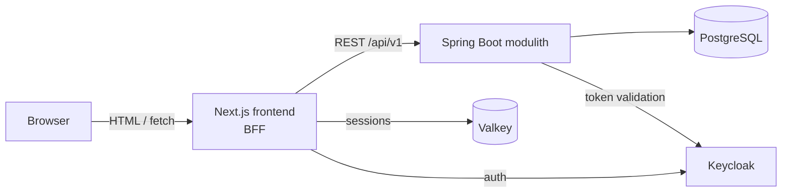

# Kalia

[](https://github.com/MiguelSombrero/kalia/actions/workflows/ci.yml)

> **Status:** iterations 0–6 complete — a visitor can browse and search the
> seeded beer catalog end to end (verified: find "Westvleteren" by name,
> filter Belgian quads 9–12 % ABV, open beer details), the UI has its own
> design system (tokens, shared primitives, loading/error/empty states,
> WCAG 2.1 AA), production-readiness foundations (logging, exception
> handling, config, security headers, dependency scanning) are in place,
> users can sign in and out via Keycloak, and a signed-in user can add,
> edit and remove bottles in their own personal beer cellar, grouped by
> beer with brewed/best-before dates. A user now has a profile and can make
> that cellar public: anyone with the link — signed in or not — can browse
> it, and set back to private it leaks nothing, not even that it exists.
> Next: sign-up, so someone other than the author can create an account
> (iteration 6.5). Implementation proceeds one
> issue at a time. See [docs/roadmap.md](docs/roadmap.md) for what gets
> built and in which order.

## Goal

Kalia is hobby project developed with AI agents, focusing on the development process rather than fast-to-market. The main goals for this project is to:

1. create solid agentic development process which ensures the quality of the product (no drift between documentation and implementation, comprehensive tests etc.)

2. production-grade standards for architecture, design and code.

## Vision

Kalia is a social platform for beer enthusiasts, built around the beer cellar.

Enthusiasts age beer. A cellar is the record of what is down there: which
beers, which bottles, when each was brewed and how long it has left. Kalia
keeps that record, and makes it something you can share.

Three things carry the product:

- **The cellar** — the reason Kalia exists. A cellar holds _bottles_, not just
  beers: an AleSmith IPA brewed in January 2026 is a different thing from one
  brewed two years earlier, and a cellar that cannot tell them apart is a list,
  not a cellar. Yours is private until you decide otherwise; a public cellar is
  something anyone can browse.
- **The catalog** — what makes the cellar possible, since you have to find a
  beer before you can own it. It grows the way it has to: new beers appear
  faster than any single source keeps up with, so the people using Kalia add
  them.
- **The feed** — what makes it social. Adding a beer to your cellar is news to
  people who care about beer; the front page is where that shows up, and where
  a public cellar gets found.

And what Kalia deliberately is not. **It is not a beer review platform** —
Untappd and Pint Please do that well and Kalia will not compete with them. A
rating is a number Kalia _shows_, sourced from elsewhere, never one it collects.
**It is not a beer shop** either; at most, some distant day, it may tell you
where a beer can be bought and for how much.

## Roles

**MiguelSombrero — product owner.** Sets vision and goals, owns every
architecture and design decision, prioritises and refines the backlog, reviews
code and merges pull requests. Does not write code.

**AI agents** produce all documentation and code, in four roles:

- **Scrum master** — proposes iterations, distils the vision into scope, writes
  task files and drives the refinement conversation. Never moves a task to
  `refined` on its own behalf; that transition is the product owner's gate.
- **Architect** — designs module boundaries and data models, proposes ADRs,
  keeps [docs/architecture.md](docs/architecture.md) true. Lays out the
  trade-offs and guides the product owner through them; the product owner
  decides.
- **Developer** — implements one refined task at a time, test-first, and opens
  the pull request.
- **Reviewer** — runs the code-review gate on every diff and the periodic
  quality sweep, and treats review comments as a dialogue, not instructions.

## Run locally

Create a `.env` file at the repository root first — Docker Compose loads it
automatically, and `docker-compose.yml` has no default for this one value on
purpose, since it is a credential:

```bash
echo "KALIA_FRONTEND_CLIENT_SECRET=kalia-dev-secret" > .env
docker compose up --build   # frontend at http://localhost:3000
```

The frontend is published at `:3000`; the backend is also published, at
`:8080` (localhost only) for direct API access and Swagger UI — see
[backend/README.md](backend/README.md). Keycloak's admin console is at
`:8081` (admin/admin, dev-only credentials) and Valkey at `:6379`. All
bindings are localhost-only, never reachable beyond the dev machine.
[keycloak/realm-export.json](keycloak/realm-export.json) carries no
credential — the `kalia-frontend` client secret above and the Postgres
password in [docker-compose.yml](docker-compose.yml) (`POSTGRES_PASSWORD`,
falling back to `kalia`) are fixed dev-only values — never reuse them outside
local development. The realm file is applied to Keycloak by the
`keycloak-config` service (`keycloak-config-cli`,
[ADR-0054](docs/adr/0054-keycloak-config-cli-realm-management.md)) on every
startup, not baked into the Keycloak image — it fully reconciles the realm
each run, so a change made in the admin console is overwritten on the next
`docker compose up`. `make verify` fails if the running realm has drifted
from the file; re-apply with `docker compose up -d --wait keycloak-config`.
To sign in to Kalia itself (not
the Keycloak admin console), use the seeded dev account `testuser` /
`testuser123`, created idempotently on every startup by the `keycloak-seed`
service rather than baked into the realm export. For development with hot
reload, run the apps natively — see [backend/README.md](backend/README.md)
and [frontend/README.md](frontend/README.md).

## What Kalia does

In roadmap order, a user can:

- Browse and search craft beers by name, brewery, country, style, alcohol content (ABV), and price — no account needed
- Use Kalia in English or Finnish (`/en`, `/fi`; auto-detected on first visit, switchable anytime)
- View beer details (brewery, country, style, ABV, description, price)
- Sign in with Keycloak
- Maintain a personal beer cellar: the bottles they own, each with its brewed
  and best-before dates, grouped by beer _(iteration 5)_
- Set up a profile and make their cellar public — browsable by anyone with the
  link, signed in or not _(iteration 6)_

Then:

- Sign up for an account without the product owner creating it by hand
  _(iteration 6.5)_
- A front-page feed of what people are adding to their cellars _(iteration 7)_
- A catalog that grows past its seed data, with users adding the beers they
  cannot find _(iteration 8)_

Further out, in the [backlog](docs/tasks/backlog.md): beer ratings sourced from
an external platform, likes and comments on feed events, and — dependent on
whether beer shops publish usable APIs — showing where a beer can be bought.

## Architecture

Kalia is a **monorepo** with a Next.js frontend and a Spring Boot **modulith**
backend. The frontend follows the **backend-for-frontend (BFF)** pattern: the
browser talks only to Next.js, and the Next.js server calls the Spring Boot
REST API. Auth tokens and sessions stay server-side.



The backend is a single deployable split into Spring Modulith modules
(`catalog`, `identity`, `cellar`, and `profile` as iteration 6 adds it) with
enforced boundaries, keeping a later extraction to microservices possible
without paying the distributed-systems cost now.

Full design: [docs/architecture.md](docs/architecture.md) ·
Decision records: [docs/adr/](docs/adr/)

## Tech stack

Main technologies used in this project, at major.minor precision — exact
pins drift with every dependency bump, so check `backend/pom.xml`,
`frontend/package.json` and `.github/workflows/ci.yml` for what's actually
running (a few, like Lombok, are pinned only indirectly via Spring Boot's
dependency BOM and won't show an explicit version there either). Update
this section as the project evolves!

### Backend

- Java 25, Spring Boot 4.1 with Spring Modulith 2.1 (later possibility to migrate to microservices)
- PostgreSQL 18 (data persistence), Flyway (migrations & seed data)
- Maven (build), JUnit 5 + Testcontainers + Spring Modulith verification tests;
  surefire/failsafe (Spring Boot-managed defaults; unit `*Test` /
  integration `*IT` split), JaCoCo 0.8 (merged coverage report), ArchUnit 1.5
  (package-structure rules)
- Lombok (boilerplate reduction, version managed by Spring Boot's dependency
  BOM — see backend/README.md conventions)
- springdoc-openapi 3.1 (OpenAPI spec + Swagger UI)
- spring-boot-starter-security-oauth2-resource-server (JWT validation against
  Keycloak, version managed by Spring Boot's dependency BOM — see ADR-0028)

### Frontend

- Next.js 16.3 (App Router), React 19.2, TypeScript 5.9 (TS 7 not yet
  supported by the Next toolchain — revisit when it is)
- Tailwind CSS 4 (styling)
- @radix-ui/react-dialog 1.1.23 and @radix-ui/react-toast 1.2.15 (headless
  primitives behind `components/ui/dialog.tsx` and `components/ui/toast.tsx` —
  the only two UI dependencies in an otherwise hand-written primitive set,
  taken on for focus management and `aria-live` announcement rather than
  appearance; see ADR-0021's 2026-08-22 and 2026-08-23 amendments)
- TanStack Query 5.102 (client-component data layer — see ADR-0008)
- Zustand 5.0 (client UI state — see ADR-0009)
- react-hook-form 7.83 + Zod 4.4 (+ @hookform/resolvers 5.9) for
  stateful forms and validation (ADR-0010)
- i18next 26.4 + i18next-resources-to-backend 1.2 (server-side
  localization, English + Finnish), react-i18next 17.0 (the client-component
  bridge, mounted in `app/providers.tsx` — see ADR-0011)
- orval 8.24 (API client generated from the backend's OpenAPI spec,
  committed + CI drift check — see ADR-0012)
- Vitest 4.1 + React Testing Library 16.3 (unit/component tests),
  Playwright 1.62 (E2E, chromium only, against the docker compose stack)
- `package.json` `overrides` pin `postcss` ^8.5.10 and `sharp` ^0.35.0:
  next 16.3.1 (as published) still bundles vulnerable versions of these, so
  npm can't resolve a fix within its own dependency range — remove each
  override once next bumps it themselves and `npm audit` stays clean without
  the override (the same `js-yaml` override was removed once orval 8.23.0
  bundled the fix itself)
- eslint-plugin-jsx-a11y 6.10, jest-axe 11.0 (+ @types/jest-axe 3.5),
  @axe-core/playwright 4.12 — WCAG 2.1 AA enforcement at lint/unit/E2E
  time (iteration 2 task 7)
- eslint-plugin-boundaries 7.2 (import boundaries between `app/`,
  `features/`, `components/ui/` and `lib/`, checked by `npm run lint` —
  see ADR-0012)
- next-auth 5.0.0-beta.32 (Auth.js — OIDC Authorization Code + PKCE client
  and session strategy, backed by a custom Valkey adapter — see ADR-0025)
- ioredis 6.0 (Valkey client used by the Auth.js adapter)
- Valkey 9.1 (server-side session store, Redis-API-compatible — ADR-0025)

### Local infrastructure

- Keycloak 26.7 (identity provider — OIDC for the frontend, JWT issuer for
  the backend; pinned in `docker-compose.yml`)
- Docker Compose: full stack (PostgreSQL + backend + frontend + Keycloak +
  Valkey)
- Base images: maven:3.9-eclipse-temurin-25-noble (backend build),
  eclipse-temurin:25-jre-noble (backend runtime), node:24-alpine (frontend).
  `-noble` (Ubuntu 24.04 LTS, supported to April 2029) over plain `-jre`
  (Ubuntu 26.04) clears the five CVEs Canonical's Pebble init tool carried on
  26.04 without touching the Java major — `eclipse-temurin:26-jre` also scans
  clean but is a JDK version decision on its own merits, not a side effect of
  a CVE deadline (iteration 5 task 08)

### CI

- GitHub Actions (build + test both apps on every push), SHA-pinned:
  actions/checkout v7.0, actions/setup-java v6.0, actions/setup-node v7.0

## Repository layout (planned)

```
kalia/
├── backend/          # Spring Boot modulith
│   └── src/main/java/fi/kalia/
│       ├── catalog/  # beers, breweries, search
│       ├── identity/ # Keycloak integration, current-user resolution
│       ├── cellar/   # personal beer cellar (iteration 5)
│       └── profile/  # user profile, public cellar visibility (iteration 6)
├── frontend/         # Next.js app (BFF + UI)
├── docs/
│   ├── architecture.md
│   ├── roadmap.md
│   ├── tasks/        # per-iteration task lists, backlog, quality backlog
│   └── adr/          # architecture decision records
└── docker-compose.yml
```

## Development approach

- **Iterative:** features land as small, end-to-end vertical slices
  (see [roadmap](docs/roadmap.md)) — the catalog first, because it is what the
  cellar is built on, then the cellar, then what makes it social.
- **Test-driven:** tests are written with (or before) the code — unit tests
  for domain logic, Testcontainers-backed integration tests for APIs and
  persistence, Playwright for critical user flows.
- **One issue at a time:** each roadmap task is a small, independently
  reviewable change with tests and updated docs.
- **Checks run locally, not in CI first:** `make verify` runs everything CI
  runs and `make verify-fast` the ~10 s subset; `make install-hooks` puts the
  latter behind `git push`
  ([ADR-0046](docs/adr/0046-edit-time-checks-and-one-verify-gate.md)).
  Nothing invokes an AI agent on your behalf at push time. To hand a failure
  to one deliberately, run it yourself:

  ```bash
  claude -p "Run 'make verify-fast', fix every failure it reports, and re-run until it is green. Do not change behaviour." --allowedTools "Edit,Read,Bash"
  ```

## License

See [LICENSE](LICENSE).
