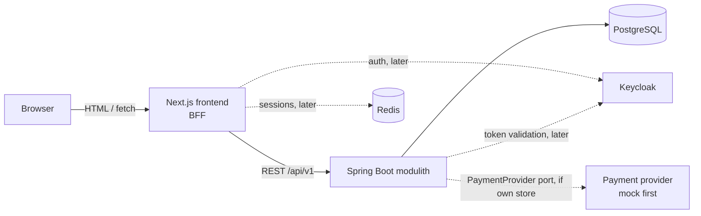

# Kalia

[](https://github.com/MiguelSombrero/kalia/actions/workflows/ci.yml)

## Vision

Kalia is a comprehensive craft beer management app and online beer store. With Kalia beer enthusiasts can search for beers, maintain their personal beer cellar, review beers and order beers online. Main use cases for Kalia is:

- User can browse and search for beers by different criteria like name, brewery, country, style, alcohol content (ABV), and price
- User can add beers to the personal beer cellar. This is the catalog of beers user owns. With beer cellar user can easily observe the beers age, quantity and other relevant info for beer enthusiast 
- User can review beers. This could be integration to some other beer review service, because there already have many good alternatives (Pint Please, Untappd, ...). Decided for later.
- User can order beers online. This could be some integration or search engine for other beer stores - like Trivago for beers. If user wants to buy Sierra Nevada Bigfoot, for example, Kalia could list all the shops that have the beer, cheapest store first. Decided for later.

## Goal

Kalia is developed with AI agents focusing on the development process rather than fast-to-market. The main goals for this project is to (1) create solid agentic development process which ensures the quality of the product (no drift between documentation and implementation, comprehensive tests etc.); (2) production-grade standards for architecture, design and code.

My, MiguelSombrero, role is to set the projects goal and vision, make architecture decisions, guide the design and review code. I do not code myself. I'm product owner which delegates all the work (documentation, coding) to the AI agents.

> **Status:** walking skeleton (iteration 0) nearly complete — backend and
> frontend scaffolding plus CI are in place; one task remains (full stack
> via `docker compose up`) before the beer catalog (iteration 1) begins.
> Implementation proceeds one issue at a time. See
> [docs/roadmap.md](docs/roadmap.md) for what gets built and in which order.

## What Kalia does

In roadmap order, a user can:

- Browse and search craft beers by name, brewery, country, style, alcohol content (ABV), and price — no account needed
- View beer details (brewery, country, style, ABV, description, price)
- Sign in with Keycloak *(iteration 2)*
- Maintain a personal beer cellar: the beers they own, with quantity, vintage/age, purchase info and notes *(iteration 3)*

Planned for later (tracked in the [roadmap](docs/roadmap.md); the open
decisions are recorded in [ADR-0006](docs/adr/0006-cellar-first.md)):

- Order beers online — either Kalia's own store flow (basket → order →
  payment, mocked provider first) or a price-comparison aggregator over
  other beer stores ("Trivago for beers"); *decided later*
- Beer reviews — own reviews or integration with an existing service
  (Untappd, Pint Please, …); *decided later*
- Inventory / stock management, admin UI for the catalog
- Recommendations ("if you liked this IPA…")

## Architecture

Kalia is a **monorepo** with a Next.js frontend and a Spring Boot **modulith**
backend. The frontend follows the **backend-for-frontend (BFF)** pattern: the
browser talks only to Next.js, and the Next.js server calls the Spring Boot
REST API. Auth tokens and sessions stay server-side.



The backend is a single deployable split into Spring Modulith modules
(`catalog`, `identity`, `cellar`; later `cart`, `ordering`, `payment` if the
own-store variant is chosen) with enforced boundaries, keeping a later
extraction to microservices possible without paying the distributed-systems
cost now.

Full design: [docs/architecture.md](docs/architecture.md) ·
Decision records: [docs/adr/](docs/adr/)

## Tech stack

Main technologies used in this project — update as the project evolves!

### Backend

- Java 25, Spring Boot 4.1.0 with Spring Modulith 2.1.0 (later possibility to migrate to microservices)
- PostgreSQL 18.4 (data persistence), Flyway (migrations & seed data)
- Maven (build), JUnit 5 + Testcontainers + Spring Modulith verification tests
- Keycloak 26.7.x (authentication — *introduced in iteration 2*)

### Frontend

- Next.js 16.2.10 (App Router), React 19.2.4, TypeScript 5.9.3 (TS 7 not yet
  supported by the Next toolchain — revisit when it is)
- Tailwind CSS 4.3.3 (styling)
- Vitest 4.1.10 + React Testing Library 16.3.2 (unit/component tests),
  Playwright (E2E — *introduced with the first E2E task*)
- Redis 8.8.x (server-side session store — *introduced in iteration 2*)
- Keycloak 26.7.x (authentication — *introduced in iteration 2*)

### Local infrastructure

- Docker Compose: PostgreSQL now; Keycloak and Redis added when auth lands

### CI

- GitHub Actions (build + test both apps on every push), SHA-pinned:
  actions/checkout v7.0.0, actions/setup-java v5.6.0, actions/setup-node v7.0.0

## Repository layout (planned)

```
kalia/
├── backend/          # Spring Boot modulith
│   └── src/main/java/fi/kalia/
│       ├── catalog/  # beers, breweries, search
│       ├── identity/ # Keycloak integration (iteration 2)
│       ├── cellar/   # personal beer cellar (iteration 3)
│       └── ...       # cart/ordering/payment if own store is chosen (backlog)
├── frontend/         # Next.js app (BFF + UI)
├── docs/
│   ├── architecture.md
│   ├── roadmap.md
│   └── adr/          # architecture decision records
└── docker-compose.yml
```

## Development approach

- **Iterative:** features land as small, end-to-end vertical slices
  (see [roadmap](docs/roadmap.md)). The enthusiast features (catalog, cellar)
  come first; the store flow waits in the backlog for the own-store vs.
  aggregator decision.
- **Test-driven:** tests are written with (or before) the code — unit tests
  for domain logic, Testcontainers-backed integration tests for APIs and
  persistence, Playwright for critical user flows.
- **One issue at a time:** each roadmap task is a small, independently
  reviewable change with tests and updated docs.

## License

See [LICENSE](LICENSE).
