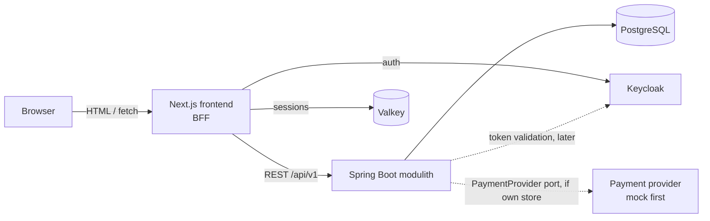

# Kalia

[](https://github.com/MiguelSombrero/kalia/actions/workflows/ci.yml)

## Vision

Kalia is a comprehensive craft beer management app and online beer store. With Kalia beer enthusiasts can search for beers, maintain their personal beer cellar, review beers and order beers online. Main use cases for Kalia is:

- User can browse and search for beers by different criteria like name, brewery, country, style, alcohol content (ABV), and price
- User can add beers to the personal beer cellar. This is the catalog of beers user owns. With beer cellar user can easily observe the beers age, quantity and other relevant info for beer enthusiast 
- User can review beers. This could be integration to some other beer review service, because there already have many good alternatives (Pint Please, Untappd, ...). Decided for later.
- User can order beers online. This could be some integration or search engine for other beer stores - like Trivago for beers. If user wants to buy Sierra Nevada Bigfoot, for example, Kalia could list all the shops that have the beer, cheapest store first. Decided for later.

## Goal

Kalia is developed with AI agents focusing on the development process rather than fast-to-market. The main goals for this project is to (1) create solid agentic development process which ensures the quality of the product (no drift between documentation and implementation, comprehensive tests etc.); (2) production-grade standards for architecture, design and code.

My, MiguelSombrero, role is to set the projects goal and vision, make architecture decisions, guide the design and review code. I do not code myself. I'm product owner which delegates all the work (documentation, coding) to the AI agents.

> **Status:** iterations 0–3 complete — a visitor can browse and search the
> seeded beer catalog end to end (verified: find "Westvleteren" by name,
> filter Belgian quads 9–12 % ABV, open beer details), the UI has its own
> design system (tokens, shared primitives, loading/error/empty states,
> WCAG 2.1 AA), and production-readiness foundations (logging, exception
> handling, config, security headers, dependency scanning) are in place.
> Next: authentication via Keycloak (iteration 4). Implementation proceeds
> one issue at a time. See [docs/roadmap.md](docs/roadmap.md) for what gets
> built and in which order.

## Run locally

```bash
docker compose up --build   # frontend at http://localhost:3000
```

The frontend is published at `:3000`; the backend is also published, at
`:8080` (localhost only) for direct API access and Swagger UI — see
[backend/README.md](backend/README.md). Keycloak's admin console is at
`:8081` (admin/admin, dev-only credentials) and Valkey at `:6379`. All
bindings are localhost-only, never reachable beyond the dev machine. The
`kalia-frontend` client secret in
[keycloak/realm-export.json](keycloak/realm-export.json) is likewise a
fixed dev-only value — never reuse it outside local development. To sign
in to Kalia itself (not the Keycloak admin console), use the seeded dev
account `testuser` / `testuser123`, also defined in that same realm
export. For development with hot reload, run the apps natively — see
[backend/README.md](backend/README.md) and
[frontend/README.md](frontend/README.md).

## What Kalia does

In roadmap order, a user can:

- Browse and search craft beers by name, brewery, country, style, alcohol content (ABV), and price — no account needed
- Use Kalia in English or Finnish (`/en`, `/fi`; auto-detected on first visit, switchable anytime)
- View beer details (brewery, country, style, ABV, description, price)
- Sign in with Keycloak *(auth iteration)*
- Maintain a personal beer cellar: the beers they own, with quantity, vintage/age, purchase info and notes *(cellar iteration)*

Planned for later (tracked in the [roadmap](docs/roadmap.md); the open
decisions are recorded in [ADR-0006](docs/adr/0006-cellar-first.md)):

- Order beers online — either Kalia's own store flow (basket → order →
  payment, mocked provider first) or a price-comparison aggregator over
  other beer stores ("Trivago for beers"); *decided later*
- Beer reviews — own reviews or integration with an existing service
  (Untappd, Pint Please, …); *decided later*
- Inventory / stock management, admin UI for the catalog
- Recommendations ("if you liked this IPA…")

## Architecture

Kalia is a **monorepo** with a Next.js frontend and a Spring Boot **modulith**
backend. The frontend follows the **backend-for-frontend (BFF)** pattern: the
browser talks only to Next.js, and the Next.js server calls the Spring Boot
REST API. Auth tokens and sessions stay server-side.



The backend is a single deployable split into Spring Modulith modules
(`catalog`, `identity`, `cellar`; later `cart`, `ordering`, `payment` if the
own-store variant is chosen) with enforced boundaries, keeping a later
extraction to microservices possible without paying the distributed-systems
cost now.

Full design: [docs/architecture.md](docs/architecture.md) ·
Decision records: [docs/adr/](docs/adr/)

## Tech stack

Main technologies used in this project, at major.minor precision — exact
pins drift with every dependency bump, so check `backend/pom.xml`,
`frontend/package.json` and `.github/workflows/ci.yml` for what's actually
running (a few, like Lombok, are pinned only indirectly via Spring Boot's
dependency BOM and won't show an explicit version there either). Update
this section as the project evolves!

### Backend

- Java 25, Spring Boot 4.1 with Spring Modulith 2.1 (later possibility to migrate to microservices)
- PostgreSQL 18 (data persistence), Flyway (migrations & seed data)
- Maven (build), JUnit 5 + Testcontainers + Spring Modulith verification tests;
  surefire/failsafe (Spring Boot-managed defaults; unit `*Test` /
  integration `*IT` split), JaCoCo 0.8 (merged coverage report), ArchUnit 1.4
  (package-structure rules)
- Lombok (boilerplate reduction, version managed by Spring Boot's dependency
  BOM — see backend/README.md conventions)
- springdoc-openapi 3.0 (OpenAPI spec + Swagger UI)
- spring-boot-starter-security-oauth2-resource-server (JWT validation against
  Keycloak, version managed by Spring Boot's dependency BOM — see ADR-0028)

### Frontend

- Next.js 16.2 (App Router), React 19.2, TypeScript 5.9 (TS 7 not yet
  supported by the Next toolchain — revisit when it is)
- Tailwind CSS 4 (styling)
- TanStack Query 5.101 (client-component data layer — see ADR-0008)
- Zustand 5.0 (client UI state — see ADR-0009)
- react-hook-form 7.82 + Zod 4.4 (+ @hookform/resolvers 5.5) for
  stateful forms and validation (ADR-0010)
- i18next 26.3 + i18next-resources-to-backend 1.2 (server-side
  localization, English + Finnish), react-i18next 17.0 (the client-component
  bridge, mounted in `app/providers.tsx` — see ADR-0011)
- orval 8.23 (API client generated from the backend's OpenAPI spec,
  committed + CI drift check — see ADR-0012)
- Vitest 4.1 + React Testing Library 16.3 (unit/component tests),
  Playwright 1.62 (E2E, chromium only, against the docker compose stack)
- `package.json` `overrides` pin `postcss` ^8.5.10 and `sharp` ^0.35.0:
  next 16.2.11 (as published) still bundles vulnerable versions of these, so
  npm can't resolve a fix within its own dependency range — remove each
  override once next bumps it themselves and `npm audit` stays clean without
  the override (the same `js-yaml` override was removed once orval 8.23.0
  bundled the fix itself)
- eslint-plugin-jsx-a11y 6.10, jest-axe 10.0 (+ @types/jest-axe 3.5),
  @axe-core/playwright 4.12 — WCAG 2.1 AA enforcement at lint/unit/E2E
  time (iteration 2 task 7)
- next-auth 5.0.0-beta.32 (Auth.js — OIDC Authorization Code + PKCE client
  and session strategy, backed by a custom Valkey adapter — see ADR-0025)
- ioredis 5.11 (Valkey client used by the Auth.js adapter)
- Valkey 9.1 (server-side session store, Redis-API-compatible — ADR-0025)

### Local infrastructure

- Keycloak 26.7 (identity provider — OIDC for the frontend, JWT issuer for
  the backend; pinned in `docker-compose.yml`)
- Docker Compose: full stack (PostgreSQL + backend + frontend + Keycloak +
  Valkey)
- Base images: maven:3.9-eclipse-temurin-25 (backend build),
  eclipse-temurin:25-jre (backend runtime), node:24-alpine (frontend)

### CI

- GitHub Actions (build + test both apps on every push), SHA-pinned:
  actions/checkout v7.0, actions/setup-java v5.6, actions/setup-node v7.0

## Repository layout (planned)

```
kalia/
├── backend/          # Spring Boot modulith
│   └── src/main/java/fi/kalia/
│       ├── catalog/  # beers, breweries, search
│       ├── identity/ # Keycloak integration (auth iteration)
│       ├── cellar/   # personal beer cellar (cellar iteration)
│       └── ...       # cart/ordering/payment if own store is chosen (backlog)
├── frontend/         # Next.js app (BFF + UI)
├── docs/
│   ├── architecture.md
│   ├── roadmap.md
│   ├── tasks/        # per-iteration task lists, backlog, quality backlog
│   └── adr/          # architecture decision records
└── docker-compose.yml
```

## Development approach

- **Iterative:** features land as small, end-to-end vertical slices
  (see [roadmap](docs/roadmap.md)). The enthusiast features (catalog, cellar)
  come first; the store flow waits in the backlog for the own-store vs.
  aggregator decision.
- **Test-driven:** tests are written with (or before) the code — unit tests
  for domain logic, Testcontainers-backed integration tests for APIs and
  persistence, Playwright for critical user flows.
- **One issue at a time:** each roadmap task is a small, independently
  reviewable change with tests and updated docs.

## License

See [LICENSE](LICENSE).
