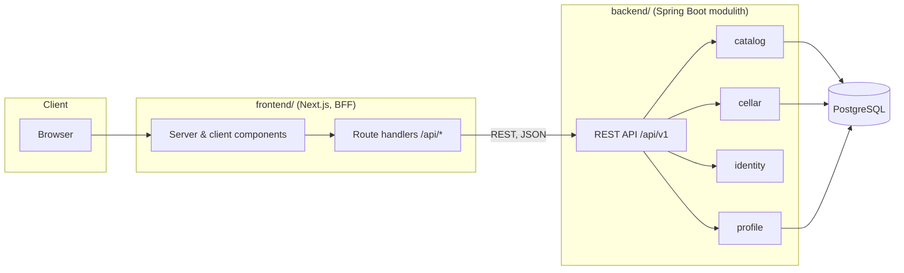

# Kalia — Architecture

*Last updated: 2026-09-01. This document describes **what is built**, plus the
iteration currently being built — nothing beyond it. What might come next lives
in [docs/roadmap.md](roadmap.md) and [docs/tasks/](tasks/); why a shape was
chosen lives in the ADRs ([ADR-0020](adr/0020-documentation-roles.md)). Update
it in the same PR as the change it describes; record significant decisions as
ADRs in [adr/](adr/) and index them in
[§9](#9-architecture-decision-records).*

## 1. Context and goals

Kalia is a social platform for beer enthusiasts built around the beer cellar:
find a beer in the catalog, record the bottles of it you own, and — as the
[vision](../README.md) is built out — share that cellar and see what others are
putting in theirs. The project is developed process-first by AI agents: the
product owner sets vision and goals, owns every architecture and design
decision and reviews; agents implement all documentation and code
([README.md roles](../README.md)). The design optimizes for **architectural
clarity, testability, and iterative delivery** over premature scale.

### Functional requirements

Built:

- Search/filter beers by name, brewery, country, style, ABV, price
- Beer detail view
- Sign-in and sign-out (Keycloak); browsing stays anonymous

Being built (iteration 5):

- Personal beer cellar: the signed-in user's owned bottles, each carrying its
  own brewed and best-before dates, grouped by the catalog beer they are
  bottles of

### Non-functional requirements

| Concern | Stance |
|---|---|
| Scale | Single instance of each service is fine; design must not *prevent* horizontal scaling |
| Availability | Best effort; no HA requirements |
| Latency | Catalog search should feel instant (<300 ms server time) with proper indexing; no caching layer until measurements demand it |
| Security | No secrets in the browser (BFF pattern); standard input validation; the backend denies by default and validates bearer tokens itself ([§6](#6-authentication-and-identity)) |
| Compliance | GDPR and alcohol-related regulation are out of scope for now; carried in the [backlog](tasks/backlog.md) so they aren't forgotten if the project turns real |
| Cost / team | Solo developer; minimize moving parts per iteration |

## 2. High-level design



Key properties:

- **BFF pattern** ([ADR-0003](adr/0003-bff-pattern.md)): the browser never
  calls Spring Boot directly. Next.js route handlers / server components proxy
  to the backend. Tokens and session state stay server-side; CORS is a
  non-issue.
- **Modulith** ([ADR-0002](adr/0002-spring-modulith.md)): one deployable, one
  database, but hard module boundaries verified by Spring Modulith tests.
- **Anonymous browsing, authenticated personal features**: the catalog needs
  no account; the cellar requires sign-in. Authentication was built before the
  cellar because the cellar is per-user data
  ([ADR-0006](adr/0006-cellar-first.md)).

## 3. Backend modules

Base package `fi.kalia`, one Spring Modulith module per subdomain — with
one sanctioned exception: `fi.kalia.web` holds shared, module-neutral
exception-handling advice with no subdomain of its own
([ADR-0014](adr/0014-shared-exception-handling.md)). Inside each
subdomain module, DDD-lite layers as direct subpackages — all
Modulith-internal by default
([ADR-0007](adr/0007-backend-package-structure.md)): `domain` (rich JPA
entities, value objects, repositories), `application` (use-case services),
`web` (controllers, advice, HTTP DTOs and boundary mapping), with dependency
direction **web → application → domain** — enforced by ArchUnit
(`ArchitectureTest`) alongside Spring Modulith's module-boundary verification
(`ModularityTest`). What goes in each layer:
[backend/README.md](../backend/README.md) code conventions.

The module root package is reserved for the **inter-module API** and stays
empty until the module's first consumer arrives. It obeys the same inward
dependency direction as `web` — it calls its module's `application` layer, not
`domain` repositories directly, enforced by `ArchitectureTest`. Full
ports/adapters ceremony is deferred to modules whose domain earns it.
Cross-module *writes* happen via application events — registered on the
aggregate root and drained by Spring Data on `save`, never published from a
service ([ADR-0053](adr/0053-cellar-domain-events-on-the-aggregate-root.md));
cross-module *reads* via the root-package API.

| Module | Responsibility | Depends on |
|---|---|---|
| `catalog` | Beers, breweries, styles; search & filtering | — |
| `identity` | Security filter chain, bearer-token validation, current-user resolution from the token's `sub` | — |
| `cellar` | The signed-in user's owned bottles, grouped by catalog beer *(iteration 5)*; a public cellar read for anyone *(iteration 6)* | `catalog` (read: beer existence), `identity` (current user), `profile` (read: public-cellar visibility) |
| `profile` | Who a user is to other users: a username copied once from the identity provider, plus whether their cellar is public *(iteration 6)* | — |

### Persistence

- Single PostgreSQL database; **one schema per module** so module boundaries
  are visible in the data layer and a future service extraction has clean
  seams. No cross-schema foreign keys between modules — cross-module references
  are by id only.
- Spring Data JPA with rich domain entities where behavior exists; plain
  records/projections for read models. A non-root entity in an aggregate — a
  `cellar.bottle` under its `entry` — is written only through its root and has
  no repository of its own, enforced by ArchUnit
  ([ADR-0052](adr/0052-cellar-aggregate-owns-its-writes.md)).
- Flyway owns the schema, with migrations per module directory plus `common/`
  for cross-module infrastructure (layout and version-numbering rules:
  [backend/README.md](../backend/README.md) database migrations). Seed data
  (~50–100 beers) ships as versioned migrations for deterministic dev/test
  environments.
- One PostgreSQL extension is required: `pg_trgm`, installed into `public` by
  the catalog migrations for the search indexes in the data model below.
- Spring Modulith's event publication registry uses the JDBC flavor (not JPA),
  so framework infrastructure stays out of the persistence unit; its
  `event_publication` table lives in the `public` schema, created by Flyway
  from Modulith's own DDL.

### Data model sketch

```
catalog.brewery(id, name, country, city, created_at)
catalog.beer(id, brewery_id, name, style, abv, description, price_cents, currency, created_at)
cellar.entry(id, user_id, beer_id, created_at, updated_at) — unique (user_id, beer_id)
cellar.bottle(id, entry_id, container_type, brewed_date, best_before_date, created_at, updated_at)
profile.profile(id, username, cellar_public, created_at, updated_at)
```

`style` starts as an indexed text column; normalize into its own table only
if style metadata appears. Prices are integer cents to avoid floating point.

Catalog search is served by indexes matching the shape of each filter: a
`pg_trgm` trigram `GIN` index on `lower(beer.name)` for substring matching, and
functional B-tree indexes on `lower(beer.style)` and `lower(brewery.country)`
([ADR-0044](adr/0044-catalog-search-indexes.md)).

**The cellar is two levels, not one** ([ADR-0034](adr/0034-cellar-two-level-bottle-model.md)).
A catalog beer is a *brand* (AleSmith IPA); what a person owns is a *bottle*
of it, with its own brewed and best-before dates and a container type
(bottle/can/keg). A cellar that collapses those into one row with a quantity
cannot tell a 2026 bottle from a 2024 one, which is the whole point of
cellaring beer. So `cellar` holds one entry per (user, catalog beer), owning
the individual bottles beneath it; quantity is always `COUNT(*)` over those
rows, never a stored column — adding several bottles at once (a purchased
case) is a bulk *operation* that still creates one row per bottle, not a
batch row with a count. `user_id` and `beer_id` are cross-module references
by id only, matching the persistence rule above. Both tables carry
`created_at` and `updated_at`, the convention this module sets going forward;
`catalog.beer` predates it and has only `created_at`. A bottle is removed by
deleting its row — there is no "drunk" state yet. An entry is a pure grouping,
not something a user keeps: it is deleted when its last bottle is removed, so
the cellar holds exactly the beers you own bottles of and no reader ever sees
a zero-quantity row. Re-adding that beer creates a fresh entry
([ADR-0034](adr/0034-cellar-two-level-bottle-model.md)).

**A profile is keyed by the Keycloak `sub` itself** — `profile.profile.id`
carries no separate generated id — **and is created lazily**, the first time
anything needs one, rather than at sign-in (ADR-0049). `username` is copied
from the token's `preferred_username` at that moment and never written again,
even if a later token carries a different one; it is both the profile's
whole public identity and the URL segment a public cellar is addressed by
([ADR-0050](adr/0050-public-cellar-addressing.md)). `cellar_public` defaults
to `false`, and **a missing profile row reads as private** — the rule every
reader of it must apply, since lazy creation means the row may legitimately
not exist yet.

## 4. API design

REST, JSON, versioned under `/api/v1`. Built:

```
GET    /api/v1/beers?query=&style=&breweryId=&country=&minAbv=&maxAbv=&page=&size=&sort=
GET    /api/v1/beers/{id}
GET    /api/v1/breweries?page=&size=
GET    /api/v1/cellars/{username}                   -> a cellar its owner has made public, with its beers and bottles; 404 otherwise

# authenticated
GET    /api/v1/me                                  -> the caller behind the bearer token
GET    /api/v1/cellar                              -> the caller's entries, each with a derived quantity
GET    /api/v1/cellar/entries/{entryId}/bottles     -> one entry's bottles
POST   /api/v1/cellar/bottles                       -> add 1-24 identical bottles (body carries the catalog beerId)
PATCH  /api/v1/cellar/bottles/{id}                  -> update a bottle
DELETE /api/v1/cellar/bottles/{id}                  -> remove a bottle
GET    /api/v1/profile                              -> the caller's own profile (username, current cellar visibility)
PATCH  /api/v1/profile/visibility                   -> change whether the caller's cellar is public
```

The cellar's endpoints (iteration 5) are two-level, following the data model in
[§3](#3-backend-modules): one entry per catalog beer under `/api/v1/cellar`, its
bottles read separately per entry. `POST` answers with an array because it
creates `quantity` independently editable rows sharing one set of dates, never
a stored count — the two-level model's whole point
([ADR-0006](adr/0006-cellar-first.md)). A bottle is addressed by its own id
everywhere else — `POST`, `PATCH`, `DELETE` — never nested under its entry: an
`entryId` in that path could not be trusted any more than a caller-supplied
user id, so it would buy no isolation guarantee, only a redundant "path entry
doesn't match the bottle's real entry" case
([task 02](tasks/iteration-5/02-cellar-rest-api.md)). The list is not
paginated — a cellar is realistically far smaller than the catalog — and an
entry or bottle belonging to another user answers 404, uniformly, never 403.

`GET /api/v1/cellars/{username}` is the one cellar route a signed-out caller
may reach: the whole of a cellar its owner has marked public, its bottles
nested under their beers, in a response type of its own rather than the
owner's `EntryDto`/`BottleDto`. `cellar` owns it and reads `profile` for the
owner id and the visibility answer; the owner id is resolved before the cellar
is loaded, so a non-public cellar is never read. An unknown username, a
missing profile and a private cellar are one 404 — identical for every caller,
the owner included — so usernames cannot be walked for cellars
([ADR-0050](adr/0050-public-cellar-addressing.md)).

Conventions:

- Pagination: `page`/`size` params, response envelope with `content`,
  `totalElements`, `totalPages`, `page`. `/breweries` carries the contract but
  still sorts and slices the full table in-application, to keep its name order
  locale-independent ([ADR-0045](adr/0045-brewery-list-paginates-in-application.md)).
- **Endpoints are client-agnostic resources.** An endpoint's shape follows the
  resource, not the screen that happens to consume it; assembling several
  resources into one view is the client's job. Today the frontend is the only
  caller and does exactly that, so this holds by circumstance — it is written
  down because the cellar, profile and feed endpoints are each an opportunity
  to shape a response around one Next.js page instead.
- Authentication: bearer token, default deny — every route needs one except
  the catalog reads above, `/actuator/health` and the API docs
  ([ADR-0028](adr/0028-resource-server-and-current-user.md)). A path whose
  user is implied by the credential is top-level (`/me`, `/cellar`), never
  `/users/{id}/…`.
- Errors: RFC 9457 `application/problem+json` via Spring's
  `ProblemDetail`; validation errors list field violations. `detail` only
  ever carries messages from exception types designed as API responses;
  unexpected exceptions return message-less problems and are logged
  (see backend/README.md error-handling convention).
- DTOs at the API boundary — JPA entities never serialize directly.
- OpenAPI spec generated with springdoc (`/v3/api-docs`, Swagger UI at
  `/swagger-ui/index.html`, reachable at `localhost:8080` on the dev
  machine — see [§6](#6-authentication-and-identity)).
  Controllers carry `@Tag`/`@Operation`/`@Parameter`; DTOs carry `@Schema`.
  The frontend may later generate its TypeScript client from the spec.

## 5. Frontend design

The shape of the frontend. Day-to-day rules for writing it live in
[frontend/README.md](../frontend/README.md) conventions.

- **App Router**, server components by default; client components only where
  the browser is genuinely needed — event handlers, React state, or context.
  Search is the case worth naming, because it looks like an exception and
  isn't: the catalog's filters are a native GET form, so `SearchFilters`
  stays a server component ([ADR-0010](adr/0010-react-hook-form-zod.md)).
  A form that only navigates does not need the client.
- **Feature-based package structure**: `features/<feature>/` (catalog,
  cellar, …) owns that feature's components, hooks and API access; `app/`
  route files stay thin and delegate. Mirrors the backend's
  module-per-subdomain boundaries, down to being enforced rather than
  agreed: `eslint.config.mjs` states the layers and the directions allowed
  between them ([ADR-0012](adr/0012-orval-api-client.md)), the frontend's
  counterpart to Spring Modulith's module verification.
- Two route handlers: `app/api/auth/[...nextauth]`, Auth.js's own OIDC
  endpoints, and the deliberately unauthenticated
  `app/api/auth/backchannel-logout`, which Keycloak calls server-to-server
  ([§6](#6-authentication-and-identity),
  [frontend/README.md](../frontend/README.md) auth conventions). Sign-in and
  sign-out are Server Actions rather than posts to route handlers, so the
  CSP's `form-action 'self'` can stay strict
  ([ADR-0025](adr/0025-authjs-valkey-adapter.md)). Catalog data flows through
  server components calling `kaliaFetch` (`lib/api/mutator.ts`) directly, the
  thin wrapper that owns the backend base URL and error mapping, and attaches
  the access token belonging to the caller's own session, renewing it first if
  it has expired ([ADR-0028](adr/0028-resource-server-and-current-user.md),
  [ADR-0029](adr/0029-silent-token-refresh.md),
  [ADR-0030](adr/0030-per-session-token-storage.md)). A client component's
  read of that same authenticated data calls a Server Action instead — never
  the feature's `api.ts` directly — so the token-lookup chain stays out of
  the browser bundle ([ADR-0040](adr/0040-client-reads-via-server-actions.md)).
- **State has three homes, by kind** ([ADR-0008](adr/0008-tanstack-query.md),
  [ADR-0009](adr/0009-zustand-ui-state.md),
  [ADR-0010](adr/0010-react-hook-form-zod.md)): server data in TanStack Query,
  shareable/navigational state in URL search params (catalog filters,
  pagination), ephemeral UI state in feature-scoped Zustand stores. A
  component never calls `useQuery`/`useMutation` directly — always a
  feature-owned hook wrapping it (`useCellarBottles`,
  [ADR-0041](adr/0041-tanstack-query-feature-owned-hooks.md)). Forms
  follow the same split — navigate → native GET form, mutate/validate →
  react-hook-form + Zod.
- **API client generated from the backend's OpenAPI spec**
  ([ADR-0012](adr/0012-orval-api-client.md)) into `lib/api/generated/`
  (committed; CI regenerates and diffs to catch drift), wrapped by each
  feature rather than imported directly. Runtime failures surface as a tagged
  `ApiError` ([ADR-0023](adr/0023-typed-api-failures.md)).
- **Localization** ([ADR-0011](adr/0011-i18next-localization.md)):
  English + Finnish via i18next, locale-prefixed URLs
  (`app/[locale]/...`, e.g. `/en/beers`, `/fi/beers/{id}`). `proxy.ts`
  (Next 16's renamed `middleware.ts`) redirects locale-less requests based on
  `Accept-Language`. The one page addressed locale-less is the public cellar
  (`/cellars/{username}`), the app's only externally-shared URL: it carries
  `hreflang`/`canonical` alternates and is served `noindex, nofollow`
  ([ADR-0050](adr/0050-public-cellar-addressing.md)). The root layout sets
  `metadataBase` from `AUTH_URL` so those alternates resolve to absolute URLs.
  A cellar that is not public renders `app/[locale]/not-found.tsx`, the
  generic localized 404 for the subtree.
- **Visual design is token-driven** ([ADR-0021](adr/0021-design-tokens-ui-primitives.md)):
  Tailwind CSS with a two-layer CSS custom-property system, light mode only,
  and a small set of shared primitives in `components/ui/` — the seam for a
  possible future design-system extraction. No third-party component library;
  the two UI dependencies are `@radix-ui/react-dialog` and
  `@radix-ui/react-toast`, headless primitives behind `components/ui/dialog.tsx`
  and `components/ui/toast.tsx`, taken on for a modal's focus management and a
  toast's live-region/timing contract rather than either's appearance.
- **Loading, error and empty states have a standard shape**
  ([ADR-0022](adr/0022-loading-error-empty-states.md)): a `loading.tsx` per
  route with a shape-matched skeleton, and one `app/[locale]/error.tsx`
  covering every route.
- **Accessibility, WCAG 2.1 AA**: native semantic HTML/ARIA, explicit
  `:focus-visible` styling and a skip-to-content link. The non-native
  widgets — the add/edit-bottle and remove-confirmation modals, and the
  removal-outcome toast — get their focus trap, `aria-modal` and live-region
  behaviour from Radix rather than hand-rolled ARIA
  ([ADR-0021](adr/0021-design-tokens-ui-primitives.md)). How enforcement is
  layered across lint, unit and E2E tests:
  [frontend/README.md](../frontend/README.md) testing conventions.

## 6. Authentication and identity

Built in its own iteration ahead of the cellar, because the cellar is per-user
data ([ADR-0006](adr/0006-cellar-first.md)):

- Keycloak via OIDC Authorization Code + PKCE, handled by the Next.js
  server using Auth.js with a hand-written Adapter backing sessions onto
  Valkey (a Redis-API-compatible key-value store) — [ADR-0025](adr/0025-authjs-valkey-adapter.md)
  records why, including the internal/public Keycloak-address split this
  docker-compose stack requires. Signing in and out (including full
  Keycloak SSO logout) is built (iteration 4 task 2).
- **The backend is an OAuth2 resource server**
  ([ADR-0028](adr/0028-resource-server-and-current-user.md)): it validates
  each bearer token's signature, issuer and `kalia-backend` audience, and the
  `identity` module maps the token's `sub` to the current user — the
  canonical per-user key every module uses. The BFF attaches the session's
  access token in `lib/api/mutator.ts`.
- Catalog endpoints and the public cellar read (`GET /api/v1/cellars/*`) stay
  public; every other cellar endpoint requires authentication. The
  filter chain denies by default, so a new
  endpoint is protected unless it is deliberately listed as public. ArchUnit
  keeps that chain in place: it must exist, live in `identity`, and configure
  `oauth2ResourceServer`, and no other module may configure web security.
- The API is still published on `127.0.0.1:8080` only, for direct access and
  Swagger UI on the dev machine. Authentication makes that a defence in
  depth rather than the only one, but the loopback binding stays until a
  deployment story exists.
- **Swagger UI drives its own Authorization Code + PKCE flow**, springdoc's
  `@SecurityScheme`/`@SecurityRequirement` against Keycloak's `kalia-swagger`
  client — public, no secret, distinct from `kalia-frontend`'s confidential
  one so no secret is ever browser-visible in the docs UI. Required on every
  endpoint that needs a bearer token, so the Authorize button covers all of
  them, not `cellar` alone.
- **Access tokens are renewed silently**
  ([ADR-0029](adr/0029-silent-token-refresh.md)): the BFF trades the stored
  refresh token for a fresh set when a request needs one and the held token
  has expired. A refusal Keycloak marks `invalid_grant` ends the local session
  too, since the grant behind it is gone; any other failure leaves the session
  alone and costs only that request its token. The session is capped to the
  realm's SSO session lifetime, and the realm's token/session lifetimes are
  pinned in `keycloak/realm-export.json` rather than inherited.
- **Keycloak tokens are stored per session, not per user**
  ([ADR-0030](adr/0030-per-session-token-storage.md)): each Auth.js session
  holds its own token set, keyed by its session token, expiring and deleted
  with it. So signing out on one device ends that device's Keycloak SSO session
  and leaves any other device signed in — with one record per user, sign-out
  sent the other device's `id_token_hint` and ended the wrong session.
- **Keycloak can also tell Kalia a session ended, the other direction**
  ([ADR-0031](adr/0031-backchannel-logout.md)): an unauthenticated
  `POST /api/auth/backchannel-logout` receives OIDC Back-Channel Logout
  tokens, validates each against Keycloak's own JWKS (signature, issuer,
  audience, the backchannel-logout event claim, no `nonce`), and ends the
  local session whose Keycloak SSO session id (`sid`) matches — closing the
  gap ADR-0029 left, where an identity-provider-side logout (admin revoke,
  another RP's own logout) previously left the Kalia session alive until its
  own expiry.
- **A stale account index re-links by email rather than locking the user
  out** ([ADR-0033](adr/0033-keycloak-account-relinking.md)): if Keycloak's
  `sub` for a returning user changes — the dev stack's realm reimports on
  every restart, and a deleted-and-recreated Keycloak user would do the same
  in production — Auth.js's `allowDangerousEmailAccountLinking` links the
  sign-in to the existing user by email instead of throwing
  `OAuthAccountNotLinked`, safe only because Keycloak is the sole provider.
- **Two concurrent first-ever sign-ins for one subject resolve to one user**
  ([ADR-0043](adr/0043-createuser-race-safety.md)): `createUser` claims the
  email index with `SET NX` before writing the user record, and a request
  that loses the claim waits on the winner's record instead of creating an
  orphaned one of its own.

## 7. Testing strategy

| Layer | Tooling | What |
|---|---|---|
| Backend unit | JUnit 5 | Domain logic without a Spring context |
| Backend integration | Spring Boot Test + Testcontainers (PostgreSQL) | REST slices, repositories, Flyway migrations, event flows (`@ApplicationModuleTest`). HTTP assertions use Spring Framework 7's `RestTestClient` (`@AutoConfigureRestTestClient`) — never the legacy `TestRestTemplate`, whose autoconfiguration Spring Boot 4 dropped |
| Module boundaries | Spring Modulith `ApplicationModules.verify()` | CI fails on illegal cross-module dependencies |
| Frontend import boundaries | `eslint-plugin-boundaries` (`npm run lint`) | CI fails on an import crossing a layer the wrong way — feature to feature, the generated API client from outside a feature's `api.ts`/`types.ts`, `components/ui/` reaching upward ([ADR-0012](adr/0012-orval-api-client.md)) |
| Backend architecture rules | ArchUnit (`ArchitectureTest`) | Layer placement and dependency direction ([ADR-0007](adr/0007-backend-package-structure.md)), plus the guard keeping the one resource-server filter chain in `identity` ([ADR-0028](adr/0028-resource-server-and-current-user.md)) |
| The `noClasses()` rules among those | Re-run against `backend/src/test/java/archfixture/` | A rule no production class triggers passes whether or not its condition is right, so those rules — and only those — are also run against a codebase that breaks them |
| Dependency & image security | Trivy, scanning `pom.xml`/`package-lock.json` and both built images | CI fails on a `HIGH`/`CRITICAL` CVE with a fix available; Dependabot opens the fix PRs ([ADR-0024](adr/0024-dependency-vulnerability-scanning.md)) |
| Frontend unit/component | Vitest + React Testing Library + `jest-axe` | Components, BFF route handlers (mock backend). WCAG 2.1 AA enforcement across this and the layers below: [frontend/README.md](../frontend/README.md) testing conventions, which also covers the trap in testing async Server Components — RTL cannot render them |
| E2E | Playwright (chromium) against docker-compose stack; `webServer` in `playwright.config.ts` starts the stack itself if it isn't already running | Critical journeys: search → detail; sign in/out; cellar add → edit → remove, plus the WCAG 2.1 AA scans covered above |

Backend test naming (`*Test` vs `*IT`), the commands that run each, and what
is worth testing at all: [backend/README.md](../backend/README.md). Coverage
is measured in CI, not gated.

E2E specs live under `frontend/e2e/`, not at the repo root, even though they
exercise the whole stack (compose-run backend + Postgres are the fixture
behind every page visited): the tooling that runs them (Node/Playwright)
already lives in `frontend/`, and there is no root `package.json` /
workspaces setup to host a separate `e2e/` package without duplicating
devDependency pinning (Playwright, TypeScript, ESLint) across two lockfiles.
This mirrors backend integration tests, which need a real Postgres fixture
but live in `backend/src/test` for the same reason — the test *tooling's*
home decides placement, not the fixture's scope. Revisit if a second
frontend client appears, or the repo adopts npm workspaces for another
reason — either would justify a dedicated `e2e/` package.

Definition of done for every issue: tests written, all suites green, docs
updated if behavior or architecture changed.

## 8. Trade-offs made explicit

- **Modulith over microservices**: one deployable and one DB keeps ops trivial
  for a solo project; module verification preserves the option to extract
  services later. Cost: discipline required at boundaries.
- **BFF over direct API calls**: an extra hop and a bit of proxy code, in
  exchange for no tokens in the browser and no CORS surface.
- **Seed data over admin UI/import**: deterministic environments now, at the
  cost of a catalog that cannot grow without a migration — the ceiling
  iteration 8 removes.
- **No backend read-caching yet**: PostgreSQL with indexes is plenty at this
  scale; add caching only after measuring. This is about the backend's own
  reads — the Valkey in this stack is the frontend's session store
  ([§6](#6-authentication-and-identity)), not a cache the
  backend consults.

## 9. Architecture decision records

All decisions live in [adr/](adr/); the tables below are the index. Add a row
when adding an ADR, and update the status column when a later ADR changes an
earlier one. New ADRs follow [template.md](adr/template.md); the format and
the rules behind it are
[ADR-0019](adr/0019-adr-format-and-conventions.md), and what earns an ADR in
the first place is [ADR-0032](adr/0032-when-a-decision-earns-an-adr.md).

The index is split in two because the two sets grow for different reasons:
decisions about the product, and decisions about how the project works on
itself. Splitting them keeps each rate visible on its own. For a subject-by-
subject grouping — the authentication decisions as a set, say — see
[adr/README.md](adr/README.md), which indexes the same ADRs by theme and
carries a one-line gloss rather than a second copy of these titles.

The status column holds the vocabulary token only. What superseded or amended
a decision is recorded in that ADR's own `Supersedes` / `Superseded-by` /
`Amended` fields, so it lives in exactly one place — the two copies of that
prose had already drifted apart before this rule existed.

CI runs `scripts/check-adrs.mjs` on every push, verifying that every ADR has
a matching index row here (title and status), that it is also listed in
[adr/README.md](adr/README.md), and that ADRs following the template keep a
`Bad`/`Neutral` consequence — see the "ADR index check" job in
[ci.yml](../.github/workflows/ci.yml). Its sibling `scripts/check-tasks.mjs`
does the same for task files against their iteration index
([ADR-0026](adr/0026-task-file-format.md)), and `scripts/check-comments.mjs`
enforces the mechanically decidable half of the code-comment policy
([ADR-0017](adr/0017-code-comment-policy.md)). All three also run locally —
inside `make verify`, and at edit time via a `PostToolUse` hook that reports
the failure back to the agent without blocking
([ADR-0046](adr/0046-edit-time-checks-and-one-verify-gate.md)).

### Product and system architecture

| Id | Title | Status | Date |
|---|---|---|---|
| [ADR-0001](adr/0001-monorepo.md) | Monorepo for frontend and backend | accepted | 2026-07-15 |
| [ADR-0002](adr/0002-spring-modulith.md) | Spring Modulith backend, not microservices | accepted | 2026-07-15 |
| [ADR-0003](adr/0003-bff-pattern.md) | Backend-for-frontend (BFF) pattern | accepted | 2026-07-15 |
| [ADR-0004](adr/0004-backend-cart.md) | Cart is a backend domain module | deprecated | 2026-07-15 |
| [ADR-0005](adr/0005-defer-auth-mock-payments.md) | Defer authentication; mock the payment provider | deprecated | 2026-07-15 |
| [ADR-0006](adr/0006-cellar-first.md) | Cellar first — store flow deferred to backlog | accepted | 2026-07-17 |
| [ADR-0007](adr/0007-backend-package-structure.md) | DDD-lite package structure inside Modulith modules | accepted | 2026-07-21 |
| [ADR-0008](adr/0008-tanstack-query.md) | TanStack Query for client-component API calls | accepted | 2026-07-21 |
| [ADR-0009](adr/0009-zustand-ui-state.md) | Zustand for client UI state | accepted | 2026-07-21 |
| [ADR-0010](adr/0010-react-hook-form-zod.md) | react-hook-form + Zod for forms and validation | accepted | 2026-07-21 |
| [ADR-0011](adr/0011-i18next-localization.md) | i18next localization (English + Finnish) | accepted | 2026-07-21 |
| [ADR-0012](adr/0012-orval-api-client.md) | orval-generated API client from the backend's OpenAPI spec | accepted | 2026-07-22 |
| [ADR-0013](adr/0013-logging-conventions.md) | Structured logging conventions | accepted | 2026-07-24 |
| [ADR-0014](adr/0014-shared-exception-handling.md) | Shared, module-neutral exception-handling strategy | accepted | 2026-07-25 |
| [ADR-0015](adr/0015-configuration-strategy.md) | Environment-variable configuration, not Spring profiles | accepted | 2026-07-25 |
| [ADR-0016](adr/0016-security-response-headers.md) | Security response headers via `next.config.ts` | accepted | 2026-07-26 |
| [ADR-0018](adr/0018-frontend-env-var-validation.md) | Frontend environment-variable validation via `instrumentation.ts` | accepted | 2026-07-26 |
| [ADR-0021](adr/0021-design-tokens-ui-primitives.md) | Two-layer CSS design tokens and three shared UI primitives, no new dependency | accepted | 2026-07-27 |
| [ADR-0022](adr/0022-loading-error-empty-states.md) | Shape-matched loading skeletons, one error boundary at the locale root | accepted | 2026-07-27 |
| [ADR-0023](adr/0023-typed-api-failures.md) | API failures are a tagged `ApiError`, and a non-2xx status is not one | accepted | 2026-07-27 |
| [ADR-0024](adr/0024-dependency-vulnerability-scanning.md) | Trivy scans dependencies and images in CI; Dependabot opens the fixes | accepted | 2026-07-27 |
| [ADR-0025](adr/0025-authjs-valkey-adapter.md) | Auth.js with a custom Valkey adapter for Keycloak authentication | accepted | 2026-07-28 |
| [ADR-0028](adr/0028-resource-server-and-current-user.md) | The backend is an OAuth2 resource server, and the token's subject is the user | accepted | 2026-07-31 |
| [ADR-0029](adr/0029-silent-token-refresh.md) | Renew access tokens lazily, and end the session when the grant is gone | accepted | 2026-08-07 |
| [ADR-0030](adr/0030-per-session-token-storage.md) | Store the Keycloak token set per session, not per user | accepted | 2026-08-07 |
| [ADR-0031](adr/0031-backchannel-logout.md) | Validate Keycloak's Back-Channel Logout token and end the matching session by sid | accepted | 2026-08-07 |
| [ADR-0033](adr/0033-keycloak-account-relinking.md) | Allow email-based Keycloak account re-linking, since it is the only provider | accepted | 2026-08-08 |
| [ADR-0034](adr/0034-cellar-two-level-bottle-model.md) | Cellar holds one row per bottle, quantity always derived — never a stored count | accepted | 2026-08-09 |
| [ADR-0036](adr/0036-pre-deployment-migration-edits.md) | Applied Flyway migrations may be edited before Kalia's first deployment | accepted | 2026-08-09 |
| [ADR-0037](adr/0037-functional-modules.md) | The frontend is functional — no classes, discriminated unions over polymorphism, factory functions for DI | accepted | 2026-08-11 |
| [ADR-0040](adr/0040-client-reads-via-server-actions.md) | A client component's read of authenticated data goes through a Server Action, not the generated client directly | accepted | 2026-08-16 |
| [ADR-0041](adr/0041-tanstack-query-feature-owned-hooks.md) | Client components call a feature-owned hook, never `useQuery`/`useMutation` directly | accepted | 2026-08-16 |
| [ADR-0042](adr/0042-bounded-request-parameters.md) | Every backend request parameter is bounded, named, and cross-field checks report through `detail` | accepted | 2026-08-23 |
| [ADR-0043](adr/0043-createuser-race-safety.md) | `createUser` claims the email index with SET NX so a losing concurrent sign-in joins the winner | accepted | 2026-08-23 |
| [ADR-0044](adr/0044-catalog-search-indexes.md) | Catalog name search stays substring matching, served by a pg_trgm trigram index | accepted | 2026-08-28 |
| [ADR-0045](adr/0045-brewery-list-paginates-in-application.md) | The brewery list paginates in the application, keeping its Java-side name sort | accepted | 2026-08-29 |
| [ADR-0049](adr/0049-profile-module-and-public-identity.md) | A `profile` module owns who a user is to other users | accepted | 2026-08-30 |
| [ADR-0050](adr/0050-public-cellar-addressing.md) | A public cellar has one locale-less URL and is indistinguishable from nothing when private | accepted | 2026-08-30 |
| [ADR-0052](adr/0052-cellar-aggregate-owns-its-writes.md) | A bottle is written only through the entry that owns it, and a violated bottle rule is a cellar type from the start | accepted | 2026-09-02 |
| [ADR-0053](adr/0053-cellar-domain-events-on-the-aggregate-root.md) | A cellar's domain events are registered on the aggregate root, not published from the service | accepted | 2026-09-04 |

### Engineering process and documentation

How the project works on itself. Kept separate because it grows for its own
reasons and its rate is worth watching independently
([ADR-0032](adr/0032-when-a-decision-earns-an-adr.md)).

| Id | Title | Status | Date |
|---|---|---|---|
| [ADR-0017](adr/0017-code-comment-policy.md) | Code comments carry only what the repo cannot | accepted | 2026-07-26 |
| [ADR-0019](adr/0019-adr-format-and-conventions.md) | A fixed ADR structure, with alternatives and costs given their own sections | accepted | 2026-07-26 |
| [ADR-0020](adr/0020-documentation-roles.md) | Each documented fact has one home — ADR why, architecture shape, README how | accepted | 2026-07-27 |
| [ADR-0026](adr/0026-task-file-format.md) | One file per task, with acceptance criteria that include tests | accepted | 2026-07-30 |
| [ADR-0027](adr/0027-process-weight.md) | Match process weight to task size — implement directly by default | accepted | 2026-07-31 |
| [ADR-0032](adr/0032-when-a-decision-earns-an-adr.md) | An ADR is earned by a rejected alternative, not by a decision's size | accepted | 2026-08-07 |
| [ADR-0035](adr/0035-agent-context-layout.md) | Per-directory CLAUDE.md files are pointers to their README, not copies of it | accepted | 2026-08-09 |
| [ADR-0038](adr/0038-in-repo-spec-driven-process.md) | Keep the in-repo spec-driven process rather than adopt GitHub Spec Kit | accepted | 2026-08-15 |
| [ADR-0039](adr/0039-mechanisms-for-recurring-rule-violations.md) | A rule agents keep breaking earns a mechanism, not more prose | accepted | 2026-08-15 |
| [ADR-0046](adr/0046-edit-time-checks-and-one-verify-gate.md) | One verify gate, run at edit time as a report and at push time as a block | accepted | 2026-08-30 |
| [ADR-0047](adr/0047-refinement-is-batched-per-iteration.md) | Refinement's unit is one iteration, not one task | accepted | 2026-08-30 |
| [ADR-0048](adr/0048-what-survives-a-claude-md-bullet.md) | A CLAUDE.md bullet keeps the rule and sheds the reason | accepted | 2026-08-30 |
| [ADR-0051](adr/0051-process-retrospection-belongs-to-the-sweep.md) | Process retrospection belongs to the sweep, not to every task | accepted | 2026-08-30 |
