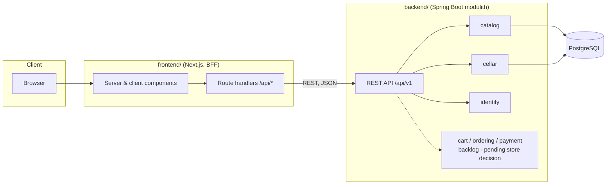

# Kalia — Architecture

*Last updated: 2026-07-19. This document describes the target architecture and
the parts of it that are deliberately deferred. Update it when decisions
change; record significant decisions as ADRs in [adr/](adr/) and index them
in [§10](#10-architecture-decision-records).*

## 1. Context and goals

Kalia is a craft beer management app and online beer store, serving beer
enthusiasts first: browse and search a beer catalog, maintain a personal
beer cellar, and later review and order beers. Whether ordering becomes
Kalia's own store or an aggregator over other stores is deliberately
undecided ([ADR-0006](adr/0006-cellar-first.md)). The project is developed
process-first by AI agents: the product owner sets vision and goals, makes
architecture decisions and reviews; agents implement all documentation and
code. The design optimizes for **architectural clarity, testability, and
iterative delivery** over premature scale.

### Functional requirements (initial scope)

- Search/filter beers by name, brewery, country, style, ABV, price
- Beer detail view
- Sign-in (Keycloak); browsing stays anonymous
- Personal beer cellar: the signed-in user's owned beers with quantity,
  vintage, purchase info, notes
- Later (backlog, decisions pending): ordering (own store flow with basket,
  orders and mocked payments — or an external-store aggregator), reviews
  (own or via integration such as Untappd/Pint Please), admin catalog
  management, inventory

### Non-functional requirements

| Concern | Stance |
|---|---|
| Scale | Single instance of each service is fine; design must not *prevent* horizontal scaling |
| Availability | Best effort; no HA requirements |
| Latency | Catalog search should feel instant (<300 ms server time) with proper indexing; no caching layer until measurements demand it |
| Security | No secrets in the browser (BFF pattern); standard input validation; auth added in its own iteration |
| Compliance | Real-world alcohol-sale regulation and GDPR are out of scope for now; noted in [§9](#9-revisit-list) so they aren't forgotten if the project turns real |
| Cost / team | Solo developer; minimize moving parts per iteration |

## 2. High-level design



Key properties:

- **BFF pattern** ([ADR-0003](adr/0003-bff-pattern.md)): the browser never
  calls Spring Boot directly. Next.js route handlers / server components proxy
  to the backend. Tokens and session state stay server-side; CORS is a
  non-issue.
- **Modulith** ([ADR-0002](adr/0002-spring-modulith.md)): one deployable, one
  database, but hard module boundaries verified by Spring Modulith tests.
- **Anonymous browsing, authenticated personal features**: the catalog needs
  no account; the cellar (and any future store flow) requires sign-in.
  Authentication arrives in its own early iteration because the cellar is per-user
  data. The anonymous-cart cookie + merge design (ADR-0004) applies only if
  the own-store variant is later chosen.

## 3. Backend modules

Base package `fi.kalia`, one Spring Modulith module per subdomain. Inside
each module, DDD-lite layers as direct subpackages — all Modulith-internal
by default ([ADR-0007](adr/0007-backend-package-structure.md)):

- `domain` — rich JPA entities as the domain model (documented exception to
  framework-free purity), value objects, repositories, specifications
- `application` — use-case services; exceptions designed as API responses
- `web` — controllers, ProblemDetail advice, HTTP DTOs (with `@Schema`) and
  entity→DTO mapping at the boundary

Dependency direction **web → application → domain**, never inward-out —
enforced by ArchUnit (`ArchitectureTest`) alongside Spring Modulith's
module-boundary verification (`ModularityTest`). The module root package is
reserved for the **inter-module API** and stays empty until the module's
first consumer arrives. Full ports/adapters ceremony is deferred to modules
whose domain earns it (payment, ordering). Cross-module *writes* happen via
application events; cross-module *reads* via the root-package API.

| Module | Responsibility | Depends on |
|---|---|---|
| `catalog` | Beers, breweries, styles; search & filtering | — |
| `identity` | Keycloak/OIDC integration, current-user resolution *(auth iteration)* | — |
| `cellar` | The signed-in user's owned beers: quantity, vintage, purchase info, notes *(cellar iteration)* | `catalog` (read: beer existence), `identity` (current user) |
| `cart` | Basket lifecycle: create, add/remove/update items, price snapshotting *(backlog — own-store variant only)* | `catalog` (read: beer existence & price) |
| `ordering` | Turning a cart into an order; order lifecycle (`PLACED → PAYMENT_PENDING → PAID / PAYMENT_FAILED → …`) *(backlog — own-store variant only)* | `cart` (read), publishes/consumes events |
| `payment` | `PaymentProvider` port + adapters; payment records *(backlog — own-store variant only)* | consumes `OrderPlaced`, publishes `PaymentSucceeded` / `PaymentFailed` |

Event flow for checkout (own-store variant, if chosen):

```
cart --(POST /orders)--> ordering: order PLACED, publishes OrderPlaced
payment: consumes OrderPlaced, calls PaymentProvider (mock), publishes PaymentSucceeded|PaymentFailed
ordering: consumes result, order → PAID | PAYMENT_FAILED
```

The mock payment adapter ([ADR-0005](adr/0005-defer-auth-mock-payments.md))
implements the same `PaymentProvider` interface a real PSP adapter will,
including simulated failures, so the ordering flow is real even while the
money is not.

### Persistence

- Single PostgreSQL database; **one schema per module** (`catalog`, `cart`,
  `ordering`, `payment`) so module boundaries are visible in the data layer
  and a future service extraction has clean seams. No cross-schema foreign
  keys between modules — cross-module references are by id only.
- Spring Data JPA with rich domain entities where behavior exists; plain
  records/projections for read models.
- Flyway migrations per module directory (plus `common/` for cross-module
  infrastructure); versions are globally unique across directories. Seed data
  (~50–100 beers) ships as versioned migrations for deterministic dev/test
  environments.
- Spring Modulith's event publication registry uses the JDBC flavor (not JPA),
  so framework infrastructure stays out of the persistence unit; its
  `event_publication` table lives in the `public` schema, created by Flyway
  from Modulith's own DDL.

### Data model sketch

```
catalog.brewery(id, name, country, city, created_at)
catalog.beer(id, brewery_id, name, style, abv, description, price_cents, currency, created_at)
cellar.cellar_item(id, user_id, beer_id, quantity, vintage_year, purchase_date, purchase_price_cents, notes, created_at, updated_at)

-- backlog (own-store variant only):
cart.cart(id, created_at, updated_at)
cart.cart_item(id, cart_id, beer_id, quantity, unit_price_cents)  -- price snapshot
ordering.order(id, cart_id, status, total_cents, currency, placed_at)
ordering.order_item(id, order_id, beer_id, name_snapshot, quantity, unit_price_cents)
payment.payment(id, order_id, provider, status, amount_cents, created_at)
```

`style` starts as an indexed text column; normalize into its own table only
if style metadata appears. Prices are integer cents to avoid floating point.

## 4. API design

REST, JSON, versioned under `/api/v1`. Illustrative endpoints:

```
GET    /api/v1/beers?query=&style=&breweryId=&country=&minAbv=&maxAbv=&page=&size=&sort=
GET    /api/v1/beers/{id}
GET    /api/v1/breweries

# authenticated (cellar iteration)
GET    /api/v1/cellar                    -> current user's cellar items
POST   /api/v1/cellar/items              -> { beerId, quantity, ... } add to cellar
PUT    /api/v1/cellar/items/{id}         -> update quantity/details
DELETE /api/v1/cellar/items/{id}

# backlog (own-store variant only): /api/v1/carts, /api/v1/orders
```

Conventions:

- Pagination: `page`/`size` params, response envelope with `content`,
  `totalElements`, `totalPages`, `page`.
- Errors: RFC 9457 `application/problem+json` via Spring's
  `ProblemDetail`; validation errors list field violations. `detail` only
  ever carries messages from exception types designed as API responses;
  unexpected exceptions return message-less problems and are logged
  (see backend/README.md error-handling convention).
- DTOs at the API boundary — JPA entities never serialize directly.
- OpenAPI spec generated with springdoc (`/v3/api-docs`, Swagger UI at
  `/swagger-ui/index.html`, reachable at `localhost:8080` on the dev
  machine — see [§6](#6-authentication-own-iteration-before-the-cellar)).
  Controllers carry `@Tag`/`@Operation`/`@Parameter`; DTOs carry `@Schema`.
  The frontend may later generate its TypeScript client from the spec.

## 5. Frontend design

- **App Router**, server components by default; client components only where
  interactivity requires (search input, cellar interactions).
- **Feature-based package structure**: `features/<feature>/` (catalog,
  cellar, …) owns that feature's components, hooks and API access; `app/`
  route files stay thin and delegate. Shared code moves to `components/` /
  `lib/` only once used by multiple features. Mirrors the backend's
  module-per-subdomain boundaries.
- Route handlers under `app/api/*` form the BFF: they attach the session's
  auth token (from the auth iteration on) and forward to Spring Boot. A single thin
  `apiClient` wrapper owns the backend base URL and error mapping.
- Styling with Tailwind CSS; no component library until a real need appears.
- Forms: react-hook-form + Zod for stateful, validated forms — the Zod
  schema is the source of truth, connected via `@hookform/resolvers`
  ([ADR-0010](adr/0010-react-hook-form-zod.md)). URL-driven GET
  search/filter forms (catalog `SearchFilters`) stay native server-component
  forms: navigate → native, mutate/validate → react-hook-form.
- State has three homes, by kind ([ADR-0008](adr/0008-tanstack-query.md),
  [ADR-0009](adr/0009-zustand-ui-state.md)): server data lives in TanStack
  Query (client components; server components keep fetching directly on the
  server), shareable/navigational state lives in URL search params (catalog
  filters, pagination), and ephemeral client UI state lives in
  feature-scoped Zustand stores — which never hold API data or duplicate
  URL state.
- **API client generated from the backend's OpenAPI spec**
  ([ADR-0012](adr/0012-orval-api-client.md)): orval generates types and
  TanStack Query hooks into `lib/api/generated/` (committed; CI regenerates
  and diffs to catch drift). Feature modules (`features/catalog/`) wrap the
  generated client behind their existing function signatures — consumers
  never import from `lib/api/generated/` directly.
- **Localization** ([ADR-0011](adr/0011-i18next-localization.md)):
  English + Finnish via i18next, locale-prefixed URLs
  (`app/[locale]/...`, e.g. `/en/beers`, `/fi/beers/{id}`). Server
  components translate via `i18n/server.ts`'s `getTranslation(locale)`;
  `proxy.ts` (Next 16's renamed `middleware.ts`) redirects locale-less
  requests based on `Accept-Language`. A minimal `LocaleSwitcher`
  (`features/i18n/`) covers the current need; full design is task 8's job.
- **Accessibility, WCAG 2.1 AA** (iteration 2 task 7): native semantic
  HTML/ARIA, with explicit `:focus-visible` styling and a skip-to-content
  link since the app has no custom interactive widgets to retrofit.
  Enforced going forward at three layers: `eslint-plugin-jsx-a11y`
  (recommended ruleset, lint time), `jest-axe` assertions on rendered
  component output (unit-test time), `@axe-core/playwright` scans of full
  catalog pages tagged `wcag2a`/`wcag2aa`/`wcag21a`/`wcag21aa` (E2E time,
  against the real containerized stack). All three ride the existing
  `frontend`/`e2e` CI jobs — no separate a11y gate exists to forget.

## 6. Authentication (own iteration, before the cellar)

Pulled forward because the cellar is per-user data ([ADR-0006](adr/0006-cellar-first.md)):

- Keycloak via OIDC Authorization Code + PKCE handled by the Next.js server
  (Auth.js or hand-rolled OIDC client), session persisted in Redis, access
  token attached to backend calls by the BFF. Spring Boot becomes an OAuth2
  resource server validating JWTs; the `identity` module maps tokens to
  users.
- Catalog endpoints stay public; cellar (and any future store) endpoints
  require authentication.
- Until the auth iteration lands, the backend API is unauthenticated.
  docker-compose publishes it on `127.0.0.1:8080` — for direct API access
  and Swagger UI on the dev machine — never beyond it; it must not be
  published on a non-loopback address or reachable over the network before
  auth lands.

## 7. Testing strategy

| Layer | Tooling | What |
|---|---|---|
| Backend unit | JUnit 5 | Domain logic (pricing, order state machine) without Spring context |
| Backend integration | Spring Boot Test + Testcontainers (PostgreSQL) | REST slices, repositories, Flyway migrations, event flows (`@ApplicationModuleTest`). HTTP assertions use Spring Framework 7's `RestTestClient` (`@AutoConfigureRestTestClient`) — never the legacy `TestRestTemplate`, whose autoconfiguration Spring Boot 4 dropped |
| Module boundaries | Spring Modulith `ApplicationModules.verify()` | CI fails on illegal cross-module dependencies |
| Frontend unit/component | Vitest + React Testing Library + `jest-axe` | Components, BFF route handlers (mock backend), and a WCAG 2.1 AA `axe()` check on every component test that does a full `render(...)`. Async Server Components with async children cannot be rendered by RTL outside Next's RSC runtime (confirmed by testing it — the render suspends indefinitely under jsdom); test each async component directly (`render(await Component(props))`, no unresolved async descendants) and test pages composing async children on their own logic (param parsing, `generateMetadata`) rather than the rendered tree — full composition is E2E's job |
| E2E | Playwright (chromium) against docker-compose stack; `webServer` in `playwright.config.ts` starts the stack itself if it isn't already running | Critical journeys: search → detail; sign in/out; cellar add → edit → remove (store journeys if/when built). `@axe-core/playwright` scans (WCAG 2.1 A/AA tags) run alongside these on every already-visited page state — no separate a11y-only spec |

Backend test naming: unit tests end in `*Test` (surefire, `test` phase, no
Docker), integration tests in `*IT` (failsafe, `verify` phase,
Testcontainers). JaCoCo merges both into one coverage report on
`mvn verify`; the ≥ 80 % aim is measured in CI, not gated
(backend/README.md testing conventions).

E2E specs live under `frontend/e2e/`, not at the repo root, even though they
exercise the whole stack (compose-run backend + Postgres are the fixture
behind every page visited): the tooling that runs them (Node/Playwright)
already lives in `frontend/`, and there is no root `package.json` /
workspaces setup to host a separate `e2e/` package without duplicating
devDependency pinning (Playwright, TypeScript, ESLint) across two lockfiles.
This mirrors backend integration tests, which need a real Postgres fixture
but live in `backend/src/test` for the same reason — the test *tooling's*
home decides placement, not the fixture's scope. Revisit if a second
frontend client appears, or the repo adopts npm workspaces for another
reason — either would justify a dedicated `e2e/` package.

Definition of done for every issue: tests written, all suites green, docs
updated if behavior or architecture changed.

## 8. Trade-offs made explicit

- **Modulith over microservices**: one deployable and one DB keeps ops trivial
  for a solo project; module verification preserves the option to extract
  services later. Cost: discipline required at boundaries.
- **BFF over direct API calls**: an extra hop and a bit of proxy code, in
  exchange for no tokens in the browser and no CORS surface.
- **Backend-owned cart over session cart** (deferred with the store flow):
  slightly more upfront work, but pricing/stock rules stay in the domain and
  nothing migrates later ([ADR-0004](adr/0004-backend-cart.md)).
- **Seed data over admin UI/import**: deterministic environments now; admin
  CRUD becomes a later iteration instead of a prerequisite.
- **No caching / no Redis on the backend yet**: PostgreSQL with indexes is
  plenty at this scale; add caching only after measuring.

## 9. Revisit list

Things intentionally *not* designed now, with the trigger that reopens them:

- **Own store vs. store aggregator** ("Trivago for beers") — decide with an
  ADR before any store-flow implementation starts.
- **Reviews: own vs. integration** (Untappd, Pint Please, …) — decide with
  an ADR when reviews reach the top of the backlog.
- **Inventory module** — only relevant if the own-store variant is chosen
  and stock workflows appear.
- **Real PSP adapter** (e.g. Paytrail/Stripe sandbox) — own-store variant
  only, when the mocked flow is stable end-to-end.
- **Search engine** (pg full-text is fine; OpenSearch only if faceted search
  outgrows it).
- **Observability** — basic logging and exception-handling conventions are
  tracked as Iteration 3 (`docs/tasks/iteration-3.md`); full metrics/tracing
  stay deferred until deployed somewhere real.
- **Compliance** (age verification, alcohol-sale regulation, GDPR) — before
  any real-customer use.
- **CI/CD & deployment** — GitHub Actions build+test early; deployment target
  chosen when something is worth deploying.
- **Root-level `e2e/` package** — E2E specs stay under `frontend/e2e/` for
  now (see §7); revisit when a second frontend client appears or the repo
  adopts npm workspaces for another reason.

## 10. Architecture decision records

All decisions live in [adr/](adr/); this table is the index. Add a row when
adding an ADR, and update the status column when a later ADR changes an
earlier one.

| Id | Title | Status | Date |
|---|---|---|---|
| [ADR-0001](adr/0001-monorepo.md) | Monorepo for frontend and backend | accepted | 2026-07-15 |
| [ADR-0002](adr/0002-spring-modulith.md) | Spring Modulith backend, not microservices | accepted | 2026-07-15 |
| [ADR-0003](adr/0003-bff-pattern.md) | Backend-for-frontend (BFF) pattern | accepted | 2026-07-15 |
| [ADR-0004](adr/0004-backend-cart.md) | Cart is a backend domain module | accepted — implementation deferred with the store flow ([ADR-0006](adr/0006-cellar-first.md)) | 2026-07-15 |
| [ADR-0005](adr/0005-defer-auth-mock-payments.md) | Defer authentication; mock the payment provider | partially superseded by [ADR-0006](adr/0006-cellar-first.md) — auth no longer deferred; mocked-payment stance stands | 2026-07-15 |
| [ADR-0006](adr/0006-cellar-first.md) | Cellar first — store flow deferred to backlog | accepted | 2026-07-17 |
| [ADR-0007](adr/0007-backend-package-structure.md) | DDD-lite package structure inside Modulith modules | accepted | 2026-07-21 |
| [ADR-0008](adr/0008-tanstack-query.md) | TanStack Query for client-component API calls | accepted | 2026-07-21 |
| [ADR-0009](adr/0009-zustand-ui-state.md) | Zustand for client UI state | accepted | 2026-07-21 |
| [ADR-0010](adr/0010-react-hook-form-zod.md) | react-hook-form + Zod for forms and validation | accepted | 2026-07-21 |
| [ADR-0011](adr/0011-i18next-localization.md) | i18next localization (English + Finnish) | accepted | 2026-07-21 |
| [ADR-0012](adr/0012-orval-api-client.md) | orval-generated API client from the backend's OpenAPI spec | accepted | 2026-07-22 |
