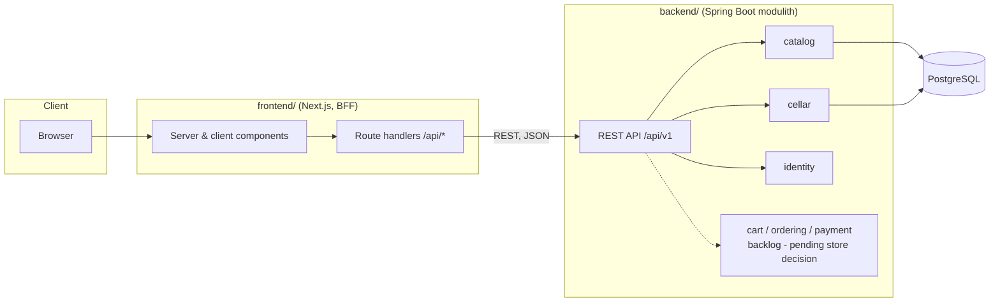

# Kalia — Architecture

*Last updated: 2026-08-07. This document describes the target architecture and
the parts of it that are deliberately deferred. Update it when decisions
change; record significant decisions as ADRs in [adr/](adr/) and index them
in [§10](#10-architecture-decision-records).*

## 1. Context and goals

Kalia is a craft beer management app and online beer store, serving beer
enthusiasts first: browse and search a beer catalog, maintain a personal
beer cellar, and later review and order beers. Whether ordering becomes
Kalia's own store or an aggregator over other stores is deliberately
undecided ([ADR-0006](adr/0006-cellar-first.md)). The project is developed
process-first by AI agents: the product owner sets vision and goals, makes
architecture decisions and reviews; agents implement all documentation and
code. The design optimizes for **architectural clarity, testability, and
iterative delivery** over premature scale.

### Functional requirements (initial scope)

- Search/filter beers by name, brewery, country, style, ABV, price
- Beer detail view
- Sign-in (Keycloak); browsing stays anonymous
- Personal beer cellar: the signed-in user's owned beers with quantity,
  vintage, purchase info, notes
- Later (backlog, decisions pending): ordering (own store flow with basket,
  orders and mocked payments — or an external-store aggregator), reviews
  (own or via integration such as Untappd/Pint Please), admin catalog
  management, inventory

### Non-functional requirements

| Concern | Stance |
|---|---|
| Scale | Single instance of each service is fine; design must not *prevent* horizontal scaling |
| Availability | Best effort; no HA requirements |
| Latency | Catalog search should feel instant (<300 ms server time) with proper indexing; no caching layer until measurements demand it |
| Security | No secrets in the browser (BFF pattern); standard input validation; auth added in its own iteration |
| Compliance | Real-world alcohol-sale regulation and GDPR are out of scope for now; noted in [§9](#9-revisit-list) so they aren't forgotten if the project turns real |
| Cost / team | Solo developer; minimize moving parts per iteration |

## 2. High-level design



Key properties:

- **BFF pattern** ([ADR-0003](adr/0003-bff-pattern.md)): the browser never
  calls Spring Boot directly. Next.js route handlers / server components proxy
  to the backend. Tokens and session state stay server-side; CORS is a
  non-issue.
- **Modulith** ([ADR-0002](adr/0002-spring-modulith.md)): one deployable, one
  database, but hard module boundaries verified by Spring Modulith tests.
- **Anonymous browsing, authenticated personal features**: the catalog needs
  no account; the cellar (and any future store flow) requires sign-in.
  Authentication arrives in its own early iteration because the cellar is per-user
  data. The anonymous-cart cookie + merge design (ADR-0004) applies only if
  the own-store variant is later chosen.

## 3. Backend modules

Base package `fi.kalia`, one Spring Modulith module per subdomain — with
one sanctioned exception: `fi.kalia.web` holds shared, module-neutral
exception-handling advice with no subdomain of its own
([ADR-0014](adr/0014-shared-exception-handling.md)). Inside each
subdomain module, DDD-lite layers as direct subpackages — all
Modulith-internal by default
([ADR-0007](adr/0007-backend-package-structure.md)): `domain` (rich JPA
entities, value objects, repositories), `application` (use-case services),
`web` (controllers, advice, HTTP DTOs and boundary mapping), with dependency
direction **web → application → domain** — enforced by ArchUnit
(`ArchitectureTest`) alongside Spring Modulith's module-boundary verification
(`ModularityTest`). What goes in each layer:
[backend/README.md](../backend/README.md) code conventions.

The module root package is reserved for the **inter-module API** and stays
empty until the module's first consumer arrives. Full ports/adapters ceremony
is deferred to modules whose domain earns it (payment, ordering). Cross-module
*writes* happen via application events; cross-module *reads* via the
root-package API.

| Module | Responsibility | Depends on |
|---|---|---|
| `catalog` | Beers, breweries, styles; search & filtering | — |
| `identity` | Security filter chain, bearer-token validation, current-user resolution from the token's `sub` | — |
| `cellar` | The signed-in user's owned beers: quantity, vintage, purchase info, notes *(cellar iteration)* | `catalog` (read: beer existence), `identity` (current user) |
| `cart` | Basket lifecycle: create, add/remove/update items, price snapshotting *(backlog — own-store variant only)* | `catalog` (read: beer existence & price) |
| `ordering` | Turning a cart into an order; order lifecycle (`PLACED → PAYMENT_PENDING → PAID / PAYMENT_FAILED → …`) *(backlog — own-store variant only)* | `cart` (read), publishes/consumes events |
| `payment` | `PaymentProvider` port + adapters; payment records *(backlog — own-store variant only)* | consumes `OrderPlaced`, publishes `PaymentSucceeded` / `PaymentFailed` |

Event flow for checkout (own-store variant, if chosen):

```
cart --(POST /orders)--> ordering: order PLACED, publishes OrderPlaced
payment: consumes OrderPlaced, calls PaymentProvider (mock), publishes PaymentSucceeded|PaymentFailed
ordering: consumes result, order → PAID | PAYMENT_FAILED
```

The mock payment adapter ([ADR-0005](adr/0005-defer-auth-mock-payments.md))
implements the same `PaymentProvider` interface a real PSP adapter will,
including simulated failures, so the ordering flow is real even while the
money is not.

### Persistence

- Single PostgreSQL database; **one schema per module** (`catalog`, `cart`,
  `ordering`, `payment`) so module boundaries are visible in the data layer
  and a future service extraction has clean seams. No cross-schema foreign
  keys between modules — cross-module references are by id only.
- Spring Data JPA with rich domain entities where behavior exists; plain
  records/projections for read models.
- Flyway owns the schema, with migrations per module directory plus `common/`
  for cross-module infrastructure (layout and version-numbering rules:
  [backend/README.md](../backend/README.md) database migrations). Seed data
  (~50–100 beers) ships as versioned migrations for deterministic dev/test
  environments.
- Spring Modulith's event publication registry uses the JDBC flavor (not JPA),
  so framework infrastructure stays out of the persistence unit; its
  `event_publication` table lives in the `public` schema, created by Flyway
  from Modulith's own DDL.

### Data model sketch

```
catalog.brewery(id, name, country, city, created_at)
catalog.beer(id, brewery_id, name, style, abv, description, price_cents, currency, created_at)
cellar.cellar_item(id, user_id, beer_id, quantity, vintage_year, purchase_date, purchase_price_cents, notes, created_at, updated_at)

-- backlog (own-store variant only):
cart.cart(id, created_at, updated_at)
cart.cart_item(id, cart_id, beer_id, quantity, unit_price_cents)  -- price snapshot
ordering.order(id, cart_id, status, total_cents, currency, placed_at)
ordering.order_item(id, order_id, beer_id, name_snapshot, quantity, unit_price_cents)
payment.payment(id, order_id, provider, status, amount_cents, created_at)
```

`style` starts as an indexed text column; normalize into its own table only
if style metadata appears. Prices are integer cents to avoid floating point.

## 4. API design

REST, JSON, versioned under `/api/v1`. Illustrative endpoints:

```
GET    /api/v1/beers?query=&style=&breweryId=&country=&minAbv=&maxAbv=&page=&size=&sort=
GET    /api/v1/beers/{id}
GET    /api/v1/breweries

# authenticated
GET    /api/v1/me                        -> the caller behind the bearer token

# authenticated (cellar iteration)
GET    /api/v1/cellar                    -> current user's cellar items
POST   /api/v1/cellar/items              -> { beerId, quantity, ... } add to cellar
PUT    /api/v1/cellar/items/{id}         -> update quantity/details
DELETE /api/v1/cellar/items/{id}

# backlog (own-store variant only): /api/v1/carts, /api/v1/orders
```

Conventions:

- Pagination: `page`/`size` params, response envelope with `content`,
  `totalElements`, `totalPages`, `page`.
- Authentication: bearer token, default deny — every route needs one except
  the catalog reads above, `/actuator/health` and the API docs
  ([ADR-0028](adr/0028-resource-server-and-current-user.md)). A path whose
  user is implied by the credential is top-level (`/me`, `/cellar`), never
  `/users/{id}/…`.
- Errors: RFC 9457 `application/problem+json` via Spring's
  `ProblemDetail`; validation errors list field violations. `detail` only
  ever carries messages from exception types designed as API responses;
  unexpected exceptions return message-less problems and are logged
  (see backend/README.md error-handling convention).
- DTOs at the API boundary — JPA entities never serialize directly.
- OpenAPI spec generated with springdoc (`/v3/api-docs`, Swagger UI at
  `/swagger-ui/index.html`, reachable at `localhost:8080` on the dev
  machine — see [§6](#6-authentication-own-iteration-before-the-cellar)).
  Controllers carry `@Tag`/`@Operation`/`@Parameter`; DTOs carry `@Schema`.
  The frontend may later generate its TypeScript client from the spec.

## 5. Frontend design

The shape of the frontend. Day-to-day rules for writing it live in
[frontend/README.md](../frontend/README.md) conventions.

- **App Router**, server components by default; client components only where
  the browser is genuinely needed — event handlers, React state, or context.
  Search is the case worth naming, because it looks like an exception and
  isn't: the catalog's filters are a native GET form, so `SearchFilters`
  stays a server component ([ADR-0010](adr/0010-react-hook-form-zod.md)).
  A form that only navigates does not need the client.
- **Feature-based package structure**: `features/<feature>/` (catalog,
  cellar, …) owns that feature's components, hooks and API access; `app/`
  route files stay thin and delegate. Mirrors the backend's
  module-per-subdomain boundaries.
- `app/api/auth/[...nextauth]` is the app's one route handler, Auth.js's own
  OIDC endpoints (§6); sign-in and sign-out are Server Actions rather than
  posts to route handlers, so the CSP's `form-action 'self'` can stay strict
  ([ADR-0025](adr/0025-authjs-valkey-adapter.md)). Catalog data flows through
  server components calling `kaliaFetch` (`lib/api/mutator.ts`) directly, the
  thin wrapper that owns the backend base URL and error mapping, and attaches
  the access token belonging to the caller's own session, renewing it first if
  it has expired ([ADR-0028](adr/0028-resource-server-and-current-user.md),
  [ADR-0029](adr/0029-silent-token-refresh.md),
  [ADR-0030](adr/0030-per-session-token-storage.md)).
- **State has three homes, by kind** ([ADR-0008](adr/0008-tanstack-query.md),
  [ADR-0009](adr/0009-zustand-ui-state.md),
  [ADR-0010](adr/0010-react-hook-form-zod.md)): server data in TanStack Query,
  shareable/navigational state in URL search params (catalog filters,
  pagination), ephemeral UI state in feature-scoped Zustand stores. Forms
  follow the same split — navigate → native GET form, mutate/validate →
  react-hook-form + Zod.
- **API client generated from the backend's OpenAPI spec**
  ([ADR-0012](adr/0012-orval-api-client.md)) into `lib/api/generated/`
  (committed; CI regenerates and diffs to catch drift), wrapped by each
  feature rather than imported directly. Runtime failures surface as a tagged
  `ApiError` ([ADR-0023](adr/0023-typed-api-failures.md)).
- **Localization** ([ADR-0011](adr/0011-i18next-localization.md)):
  English + Finnish via i18next, locale-prefixed URLs
  (`app/[locale]/...`, e.g. `/en/beers`, `/fi/beers/{id}`). `proxy.ts`
  (Next 16's renamed `middleware.ts`) redirects locale-less requests based on
  `Accept-Language`.
- **Visual design is token-driven** ([ADR-0021](adr/0021-design-tokens-ui-primitives.md)):
  Tailwind CSS with a two-layer CSS custom-property system, light mode only,
  and a small set of shared primitives in `components/ui/` — the seam for a
  possible future design-system extraction. No third-party component library.
- **Loading, error and empty states have a standard shape**
  ([ADR-0022](adr/0022-loading-error-empty-states.md)): a `loading.tsx` per
  route with a shape-matched skeleton, and one `app/[locale]/error.tsx`
  covering every route.
- **Accessibility, WCAG 2.1 AA**: native semantic HTML/ARIA, explicit
  `:focus-visible` styling and a skip-to-content link, since the app has no
  custom interactive widgets to retrofit. Enforced at three layers — lint,
  unit test and E2E — all riding the existing `frontend`/`e2e` CI jobs, so no
  separate a11y gate exists to forget. The mechanics are in
  [§7](#7-testing-strategy) and
  [frontend/README.md](../frontend/README.md).

## 6. Authentication (own iteration, before the cellar)

Pulled forward because the cellar is per-user data ([ADR-0006](adr/0006-cellar-first.md)):

- Keycloak via OIDC Authorization Code + PKCE, handled by the Next.js
  server using Auth.js with a hand-written Adapter backing sessions onto
  Valkey (a Redis-API-compatible key-value store) — [ADR-0025](adr/0025-authjs-valkey-adapter.md)
  records why, including the internal/public Keycloak-address split this
  docker-compose stack requires. Signing in and out (including full
  Keycloak SSO logout) is built (iteration 4 task 2).
- **The backend is an OAuth2 resource server**
  ([ADR-0028](adr/0028-resource-server-and-current-user.md)): it validates
  each bearer token's signature, issuer and `kalia-backend` audience, and the
  `identity` module maps the token's `sub` to the current user — the
  canonical per-user key every module uses. The BFF attaches the session's
  access token in `lib/api/mutator.ts`.
- Catalog endpoints stay public; cellar (and any future store) endpoints
  require authentication. The filter chain denies by default, so a new
  endpoint is protected unless it is deliberately listed as public. ArchUnit
  keeps that chain in place: it must exist, live in `identity`, and configure
  `oauth2ResourceServer`, and no other module may configure web security.
- The API is still published on `127.0.0.1:8080` only, for direct access and
  Swagger UI on the dev machine. Authentication makes that a defence in
  depth rather than the only one, but the loopback binding stays until a
  deployment story exists.
- **Access tokens are renewed silently**
  ([ADR-0029](adr/0029-silent-token-refresh.md)): the BFF trades the stored
  refresh token for a fresh set when a request needs one and the held token
  has expired. A refusal Keycloak marks `invalid_grant` ends the local session
  too, since the grant behind it is gone; any other failure leaves the session
  alone and costs only that request its token. The session is capped to the
  realm's SSO session lifetime, and the realm's token/session lifetimes are
  pinned in `keycloak/realm-export.json` rather than inherited.
- **Keycloak tokens are stored per session, not per user**
  ([ADR-0030](adr/0030-per-session-token-storage.md)): each Auth.js session
  holds its own token set, keyed by its session token, expiring and deleted
  with it. So signing out on one device ends that device's Keycloak SSO session
  and leaves any other device signed in — with one record per user, sign-out
  sent the other device's `id_token_hint` and ended the wrong session.

## 7. Testing strategy

| Layer | Tooling | What |
|---|---|---|
| Backend unit | JUnit 5 | Domain logic (pricing, order state machine) without Spring context |
| Backend integration | Spring Boot Test + Testcontainers (PostgreSQL) | REST slices, repositories, Flyway migrations, event flows (`@ApplicationModuleTest`). HTTP assertions use Spring Framework 7's `RestTestClient` (`@AutoConfigureRestTestClient`) — never the legacy `TestRestTemplate`, whose autoconfiguration Spring Boot 4 dropped |
| Module boundaries | Spring Modulith `ApplicationModules.verify()` | CI fails on illegal cross-module dependencies |
| Backend architecture rules | ArchUnit (`ArchitectureTest`) | Layer placement and dependency direction ([ADR-0007](adr/0007-backend-package-structure.md)), plus the guard keeping the one resource-server filter chain in `identity` ([ADR-0028](adr/0028-resource-server-and-current-user.md)) |
| The `noClasses()` rules among those | Re-run against `backend/src/test/java/archfixture/` | A rule no production class triggers passes whether or not its condition is right, so those rules — and only those — are also run against a codebase that breaks them |
| Dependency & image security | Trivy, scanning `pom.xml`/`package-lock.json` and both built images | CI fails on a `HIGH`/`CRITICAL` CVE with a fix available; Dependabot opens the fix PRs ([ADR-0024](adr/0024-dependency-vulnerability-scanning.md)) |
| Frontend unit/component | Vitest + React Testing Library + `jest-axe` | Components, BFF route handlers (mock backend), and a WCAG 2.1 AA `axe()` check on every component test that does a full `render(...)`. How to test async Server Components — RTL cannot render them — is a trap documented in [frontend/README.md](../frontend/README.md) |
| E2E | Playwright (chromium) against docker-compose stack; `webServer` in `playwright.config.ts` starts the stack itself if it isn't already running | Critical journeys: search → detail; sign in/out; cellar add → edit → remove (store journeys if/when built). `@axe-core/playwright` scans (WCAG 2.1 A/AA tags) run alongside these on every already-visited page state — no separate a11y-only spec |

Backend test naming (`*Test` vs `*IT`), the commands that run each, and what
is worth testing at all: [backend/README.md](../backend/README.md). Coverage
is measured in CI, not gated.

E2E specs live under `frontend/e2e/`, not at the repo root, even though they
exercise the whole stack (compose-run backend + Postgres are the fixture
behind every page visited): the tooling that runs them (Node/Playwright)
already lives in `frontend/`, and there is no root `package.json` /
workspaces setup to host a separate `e2e/` package without duplicating
devDependency pinning (Playwright, TypeScript, ESLint) across two lockfiles.
This mirrors backend integration tests, which need a real Postgres fixture
but live in `backend/src/test` for the same reason — the test *tooling's*
home decides placement, not the fixture's scope. Revisit if a second
frontend client appears, or the repo adopts npm workspaces for another
reason — either would justify a dedicated `e2e/` package.

Definition of done for every issue: tests written, all suites green, docs
updated if behavior or architecture changed.

## 8. Trade-offs made explicit

- **Modulith over microservices**: one deployable and one DB keeps ops trivial
  for a solo project; module verification preserves the option to extract
  services later. Cost: discipline required at boundaries.
- **BFF over direct API calls**: an extra hop and a bit of proxy code, in
  exchange for no tokens in the browser and no CORS surface.
- **Backend-owned cart over session cart** (deferred with the store flow):
  slightly more upfront work, but pricing/stock rules stay in the domain and
  nothing migrates later ([ADR-0004](adr/0004-backend-cart.md)).
- **Seed data over admin UI/import**: deterministic environments now; admin
  CRUD becomes a later iteration instead of a prerequisite.
- **No backend read-caching yet**: PostgreSQL with indexes is plenty at this
  scale; add caching only after measuring. This is about the backend's own
  reads — the Valkey in this stack is the frontend's session store
  ([§6](#6-authentication-own-iteration-before-the-cellar)), not a cache the
  backend consults.

## 9. Revisit list

Things intentionally *not* designed now, with the trigger that reopens them:

- **Own store vs. store aggregator** ("Trivago for beers") — decide with an
  ADR before any store-flow implementation starts.
- **Reviews: own vs. integration** (Untappd, Pint Please, …) — decide with
  an ADR when reviews reach the top of the backlog.
- **Inventory module** — only relevant if the own-store variant is chosen
  and stock workflows appear.
- **Real PSP adapter** (e.g. Paytrail/Stripe sandbox) — own-store variant
  only, when the mocked flow is stable end-to-end.
- **Search engine** (pg full-text is fine; OpenSearch only if faceted search
  outgrows it).
- **Observability** — basic logging and exception-handling conventions are
  tracked as Iteration 3 (`docs/tasks/iteration-3.md`); full metrics/tracing
  stay deferred until deployed somewhere real.
- **Compliance** (age verification, alcohol-sale regulation, GDPR) — before
  any real-customer use.
- **CI/CD & deployment** — GitHub Actions build+test early; deployment target
  chosen when something is worth deploying.
- **Root-level `e2e/` package** — E2E specs stay under `frontend/e2e/` for
  now (see §7); revisit when a second frontend client appears or the repo
  adopts npm workspaces for another reason.

## 10. Architecture decision records

All decisions live in [adr/](adr/); the tables below are the index. Add a row
when adding an ADR, and update the status column when a later ADR changes an
earlier one. New ADRs follow [template.md](adr/template.md); the format and
the rules behind it are
[ADR-0019](adr/0019-adr-format-and-conventions.md), and what earns an ADR in
the first place is [ADR-0031](adr/0031-when-a-decision-earns-an-adr.md).

The index is split in two because the two sets grow for different reasons:
decisions about the product, and decisions about how the project works on
itself. Splitting them keeps each rate visible on its own. For a subject-by-
subject grouping — the authentication decisions as a set, say — see
[adr/README.md](adr/README.md), which indexes the same ADRs by theme and
carries a one-line gloss rather than a second copy of these titles.

The status column holds the vocabulary token only. What superseded or amended
a decision is recorded in that ADR's own `Supersedes` / `Superseded-by` /
`Amended` fields, so it lives in exactly one place — the two copies of that
prose had already drifted apart before this rule existed.

CI runs `scripts/check-adrs.mjs` on every push, verifying that every ADR has
a matching index row here (title and status), that it is also listed in
[adr/README.md](adr/README.md), and that ADRs following the template keep a
`Bad`/`Neutral` consequence — see the "ADR index check" job in
[ci.yml](../.github/workflows/ci.yml). Its sibling `scripts/check-tasks.mjs`
does the same for task files against their iteration index
([ADR-0026](adr/0026-task-file-format.md)).

### Product and system architecture

| Id | Title | Status | Date |
|---|---|---|---|
| [ADR-0001](adr/0001-monorepo.md) | Monorepo for frontend and backend | accepted | 2026-07-15 |
| [ADR-0002](adr/0002-spring-modulith.md) | Spring Modulith backend, not microservices | accepted | 2026-07-15 |
| [ADR-0003](adr/0003-bff-pattern.md) | Backend-for-frontend (BFF) pattern | accepted | 2026-07-15 |
| [ADR-0004](adr/0004-backend-cart.md) | Cart is a backend domain module | accepted | 2026-07-15 |
| [ADR-0005](adr/0005-defer-auth-mock-payments.md) | Defer authentication; mock the payment provider | partially-superseded | 2026-07-15 |
| [ADR-0006](adr/0006-cellar-first.md) | Cellar first — store flow deferred to backlog | accepted | 2026-07-17 |
| [ADR-0007](adr/0007-backend-package-structure.md) | DDD-lite package structure inside Modulith modules | accepted | 2026-07-21 |
| [ADR-0008](adr/0008-tanstack-query.md) | TanStack Query for client-component API calls | accepted | 2026-07-21 |
| [ADR-0009](adr/0009-zustand-ui-state.md) | Zustand for client UI state | accepted | 2026-07-21 |
| [ADR-0010](adr/0010-react-hook-form-zod.md) | react-hook-form + Zod for forms and validation | accepted | 2026-07-21 |
| [ADR-0011](adr/0011-i18next-localization.md) | i18next localization (English + Finnish) | accepted | 2026-07-21 |
| [ADR-0012](adr/0012-orval-api-client.md) | orval-generated API client from the backend's OpenAPI spec | accepted | 2026-07-22 |
| [ADR-0013](adr/0013-logging-conventions.md) | Structured logging conventions | accepted | 2026-07-24 |
| [ADR-0014](adr/0014-shared-exception-handling.md) | Shared, module-neutral exception-handling strategy | accepted | 2026-07-25 |
| [ADR-0015](adr/0015-configuration-strategy.md) | Environment-variable configuration, not Spring profiles | accepted | 2026-07-25 |
| [ADR-0016](adr/0016-security-response-headers.md) | Security response headers via `next.config.ts` | accepted | 2026-07-26 |
| [ADR-0018](adr/0018-frontend-env-var-validation.md) | Frontend environment-variable validation via `instrumentation.ts` | accepted | 2026-07-26 |
| [ADR-0021](adr/0021-design-tokens-ui-primitives.md) | Two-layer CSS design tokens and three shared UI primitives, no new dependency | accepted | 2026-07-27 |
| [ADR-0022](adr/0022-loading-error-empty-states.md) | Shape-matched loading skeletons, one error boundary at the locale root | accepted | 2026-07-27 |
| [ADR-0023](adr/0023-typed-api-failures.md) | API failures are a tagged `ApiError`, and a non-2xx status is not one | accepted | 2026-07-27 |
| [ADR-0024](adr/0024-dependency-vulnerability-scanning.md) | Trivy scans dependencies and images in CI; Dependabot opens the fixes | accepted | 2026-07-27 |
| [ADR-0025](adr/0025-authjs-valkey-adapter.md) | Auth.js with a custom Valkey adapter for Keycloak authentication | accepted | 2026-07-28 |
| [ADR-0028](adr/0028-resource-server-and-current-user.md) | The backend is an OAuth2 resource server, and the token's subject is the user | accepted | 2026-07-31 |
| [ADR-0029](adr/0029-silent-token-refresh.md) | Renew access tokens lazily, and end the session when the grant is gone | accepted | 2026-08-07 |
| [ADR-0030](adr/0030-per-session-token-storage.md) | Store the Keycloak token set per session, not per user | accepted | 2026-08-07 |

### Engineering process and documentation

How the project works on itself. Kept separate because it grows for its own
reasons and its rate is worth watching independently
([ADR-0031](adr/0031-when-a-decision-earns-an-adr.md)).

| Id | Title | Status | Date |
|---|---|---|---|
| [ADR-0017](adr/0017-code-comment-policy.md) | Code comments carry only what the repo cannot | accepted | 2026-07-26 |
| [ADR-0019](adr/0019-adr-format-and-conventions.md) | A fixed ADR structure, with alternatives and costs given their own sections | accepted | 2026-07-26 |
| [ADR-0020](adr/0020-documentation-roles.md) | Each documented fact has one home — ADR why, architecture shape, README how | accepted | 2026-07-27 |
| [ADR-0026](adr/0026-task-file-format.md) | One file per task, with acceptance criteria that include tests | accepted | 2026-07-30 |
| [ADR-0027](adr/0027-process-weight.md) | Match process weight to task size — implement directly by default | accepted | 2026-07-31 |
| [ADR-0031](adr/0031-when-a-decision-earns-an-adr.md) | An ADR is earned by a rejected alternative, not by a decision's size | accepted | 2026-08-07 |
