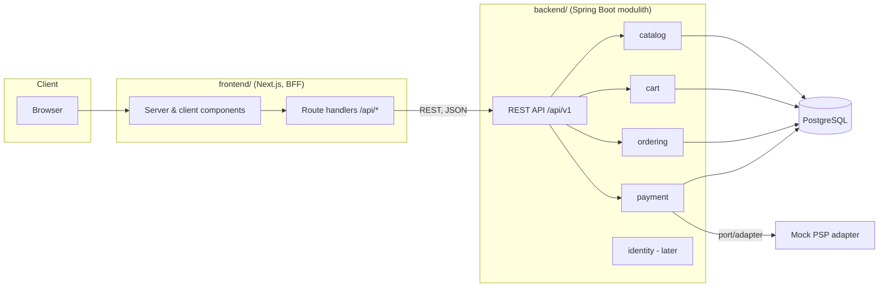

# Kalia — Architecture

*Last updated: 2026-07-15. This document describes the target architecture and
the parts of it that are deliberately deferred. Update it when decisions
change; record significant decisions as ADRs in [adr/](adr/).*

## 1. Context and goals

Kalia is an online craft beer store: customers browse and search a beer
catalog, fill a shopping basket, place orders, and pay. It is primarily a
learning/portfolio project, so the design optimizes for **architectural
clarity, testability, and iterative delivery** over premature scale.

### Functional requirements (initial scope)

- Search/filter beers by name, brewery, style, ABV, price
- Beer detail view
- Shopping basket (works anonymously)
- Order placement from a basket
- Payment via a provider abstraction (mock adapter first)
- Later: sign-in (Keycloak), persistent baskets, order history, admin catalog
  management, inventory

### Non-functional requirements

| Concern | Stance |
|---|---|
| Scale | Single instance of each service is fine; design must not *prevent* horizontal scaling |
| Availability | Best effort; no HA requirements |
| Latency | Catalog search should feel instant (<300 ms server time) with proper indexing; no caching layer until measurements demand it |
| Security | No secrets in the browser (BFF pattern); standard input validation; auth added in its own iteration |
| Compliance | Real-world alcohol-sale regulation and GDPR are out of scope for now; noted in [§9](#9-revisit-list) so they aren't forgotten if the project turns real |
| Cost / team | Solo developer; minimize moving parts per iteration |

## 2. High-level design



Key properties:

- **BFF pattern** ([ADR-0003](adr/0003-bff-pattern.md)): the browser never
  calls Spring Boot directly. Next.js route handlers / server components proxy
  to the backend. Tokens and session state stay server-side; CORS is a
  non-issue.
- **Modulith** ([ADR-0002](adr/0002-spring-modulith.md)): one deployable, one
  database, but hard module boundaries verified by Spring Modulith tests.
- **Anonymous-first**: before auth exists, the basket is keyed by a `cartId`
  (UUID) stored in an httpOnly cookie set by the BFF. When Keycloak lands, the
  anonymous cart is merged into the user's cart at sign-in.

## 3. Backend modules

Base package `fi.kalia`, one Spring Modulith module per subdomain. Modules
expose a small public API (Java interfaces + DTOs in the module root package);
everything else is module-internal. Cross-module *writes* happen via
application events; cross-module *reads* via the public API.

| Module | Responsibility | Depends on |
|---|---|---|
| `catalog` | Beers, breweries, styles; search & filtering; (initially also a simple `stockQuantity` — extract an `inventory` module only when stock logic grows) | — |
| `cart` | Basket lifecycle: create, add/remove/update items, price snapshotting | `catalog` (read: beer existence & price) |
| `ordering` | Turning a cart into an order; order lifecycle (`PLACED → PAYMENT_PENDING → PAID / PAYMENT_FAILED → …`) | `cart` (read), publishes/consumes events |
| `payment` | `PaymentProvider` port + adapters; payment records | consumes `OrderPlaced`, publishes `PaymentSucceeded` / `PaymentFailed` |
| `identity` | Keycloak/OIDC integration, current-user resolution *(later iteration)* | — |

Event flow for checkout (target state):

```
cart --(POST /orders)--> ordering: order PLACED, publishes OrderPlaced
payment: consumes OrderPlaced, calls PaymentProvider (mock), publishes PaymentSucceeded|PaymentFailed
ordering: consumes result, order → PAID | PAYMENT_FAILED
```

The mock payment adapter ([ADR-0005](adr/0005-defer-auth-mock-payments.md))
implements the same `PaymentProvider` interface a real PSP adapter will,
including simulated failures, so the ordering flow is real even while the
money is not.

### Persistence

- Single PostgreSQL database; **one schema per module** (`catalog`, `cart`,
  `ordering`, `payment`) so module boundaries are visible in the data layer
  and a future service extraction has clean seams. No cross-schema foreign
  keys between modules — cross-module references are by id only.
- Spring Data JPA with rich domain entities where behavior exists; plain
  records/projections for read models.
- Flyway migrations per module directory; seed data (~50–100 beers) ships as
  versioned migrations for deterministic dev/test environments.

### Data model sketch (iteration 1–4)

```
catalog.brewery(id, name, country, city)
catalog.beer(id, brewery_id, name, style, abv, description, price_cents, currency, stock_quantity, created_at)
cart.cart(id, created_at, updated_at)
cart.cart_item(id, cart_id, beer_id, quantity, unit_price_cents)  -- price snapshot
ordering.order(id, cart_id, status, total_cents, currency, placed_at)
ordering.order_item(id, order_id, beer_id, name_snapshot, quantity, unit_price_cents)
payment.payment(id, order_id, provider, status, amount_cents, created_at)
```

`style` starts as an indexed text column; normalize into its own table only
if style metadata appears. Prices are integer cents to avoid floating point.

## 4. API design

REST, JSON, versioned under `/api/v1`. Illustrative endpoints:

```
GET  /api/v1/beers?query=&style=&breweryId=&minAbv=&maxAbv=&page=&size=&sort=
GET  /api/v1/beers/{id}
GET  /api/v1/breweries
POST /api/v1/carts                      -> creates cart, returns id
GET  /api/v1/carts/{id}
PUT  /api/v1/carts/{id}/items/{beerId}  -> set quantity (0 removes)
POST /api/v1/orders                     -> { cartId } -> places order
GET  /api/v1/orders/{id}
```

Conventions:

- Pagination: `page`/`size` params, response envelope with `content`,
  `totalElements`, `totalPages`, `page`.
- Errors: RFC 9457 `application/problem+json` via Spring's
  `ProblemDetail`; validation errors list field violations.
- DTOs at the API boundary — JPA entities never serialize directly.
- OpenAPI spec generated (springdoc) once endpoints exist; the frontend may
  later generate its TypeScript client from it.

## 5. Frontend design

- **App Router**, server components by default; client components only where
  interactivity requires (search input, basket interactions).
- Route handlers under `app/api/*` form the BFF: they attach the cart cookie /
  (later) auth token and forward to Spring Boot. A single thin `apiClient`
  wrapper owns the backend base URL and error mapping.
- Styling with Tailwind CSS; no component library until a real need appears.
- Validation of user input at the boundary with Zod where forms appear
  (checkout); catalog pages are read-only and skip it.
- State: server components + URL search params for catalog filters (shareable
  URLs, no client state library). Basket state comes from the backend via the
  BFF; no Redux/Zustand unless proven necessary.

## 6. Authentication (deferred by design)

Not implemented until its own iteration ([ADR-0005](adr/0005-defer-auth-mock-payments.md)):

- Anonymous flows use the `cartId` httpOnly cookie only.
- When introduced: Keycloak via OIDC Authorization Code + PKCE handled by the
  Next.js server (Auth.js or hand-rolled OIDC client), session persisted in
  Redis, access token attached to backend calls by the BFF. Spring Boot
  becomes an OAuth2 resource server validating JWTs; `identity` module maps
  tokens to users. Anonymous cart merges into the user cart at sign-in.
- Until then the backend API is unauthenticated and must not be exposed
  publicly (docker-compose keeps it on the internal network; only Next.js is
  published).

## 7. Testing strategy

| Layer | Tooling | What |
|---|---|---|
| Backend unit | JUnit 5 | Domain logic (pricing, order state machine) without Spring context |
| Backend integration | Spring Boot Test + Testcontainers (PostgreSQL) | REST slices, repositories, Flyway migrations, event flows (`@ApplicationModuleTest`) |
| Module boundaries | Spring Modulith `ApplicationModules.verify()` | CI fails on illegal cross-module dependencies |
| Frontend unit/component | Vitest + React Testing Library | Components, BFF route handlers (mock backend) |
| E2E | Playwright against docker-compose stack | Critical journeys: search → detail → basket → order → mock payment |

Definition of done for every issue: tests written, all suites green, docs
updated if behavior or architecture changed.

## 8. Trade-offs made explicit

- **Modulith over microservices**: one deployable and one DB keeps ops trivial
  for a solo project; module verification preserves the option to extract
  services later. Cost: discipline required at boundaries.
- **BFF over direct API calls**: an extra hop and a bit of proxy code, in
  exchange for no tokens in the browser and no CORS surface.
- **Backend-owned cart over session cart**: slightly more upfront work, but
  pricing/stock rules stay in the domain and nothing migrates later
  ([ADR-0004](adr/0004-backend-cart.md)).
- **Seed data over admin UI/import**: deterministic environments now; admin
  CRUD becomes a later iteration instead of a prerequisite.
- **No caching / no Redis on the backend yet**: PostgreSQL with indexes is
  plenty at this scale; add caching only after measuring.

## 9. Revisit list

Things intentionally *not* designed now, with the trigger that reopens them:

- **Inventory module** — extract from `catalog` when reservations/stock
  workflows appear.
- **Real PSP adapter** (e.g. Paytrail/Stripe sandbox) — when the mocked flow
  is stable end-to-end.
- **Search engine** (pg full-text is fine; OpenSearch only if faceted search
  outgrows it).
- **Observability** (structured logging first; metrics/tracing when deployed
  somewhere real).
- **Compliance** (age verification, alcohol-sale regulation, GDPR) — before
  any real-customer use.
- **CI/CD & deployment** — GitHub Actions build+test early; deployment target
  chosen when something is worth deploying.
